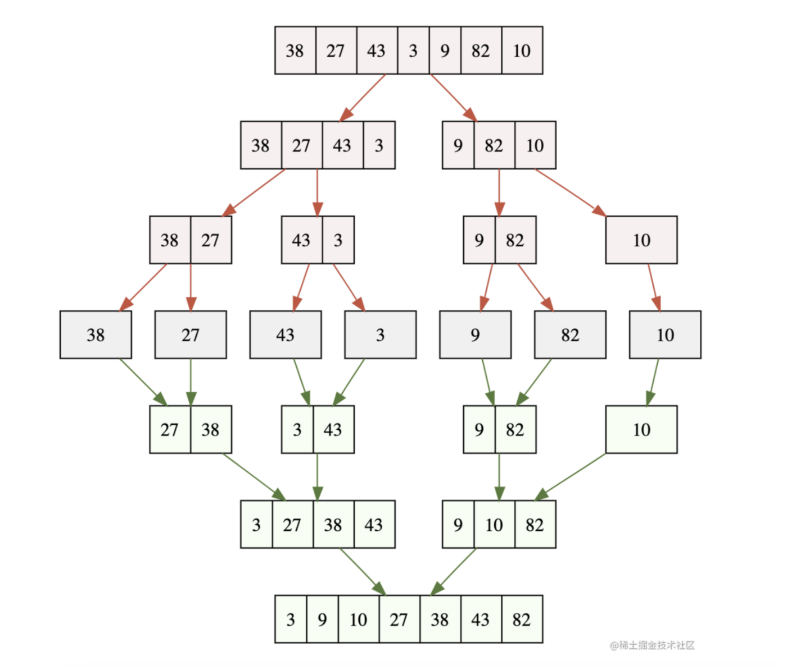

# 基础算法（Javascript）

## 排序

### 冒泡排序

```jsx
function BubbleSort(arr){ 
	for(let i=arr.length;i>1;i--){ // 轮数
			for(let j=0;j<i-1;i++){ // 每轮冒泡
				if(arr[j]>arr[j+1]){
					let temp = arr[j]
					arr[j] = arr[j+1] 
					arr[j+1] = temp
				}
			}
	}
}
```

### 选择排序

```jsx
function selectSort(arr){
	for(let i=0;i<arr.length-1;i++){
		let minIndex = i
		for(let j=i+1;j<arr.length;j++){
				if(arr[minIndex] > arr[j]){
					minIndex = j
				}
		}
		[arr[minIndex],arr[i]] = [arr[i],arr[minIndex]] 
	}
	return arr
}
```

### 插入排序

```jsx
function insertSort(arr){ 
	for(let i=1;i<arr.length;i++){ 
			while(i>0){
				if(arr[i] < arr[i-1]){
					[arr[i],arr[i-1]] = [arr[i-1],arr[i]] 
				}else{ break }
				i--
			}
	}
	return arr
}
```

### 归并排序

[JavaScript 数据结构与算法之美 - 归并排序、快速排序、希尔排序、堆排序](https://juejin.cn/post/6844903895789993997)

辅助理解



```jsx
// 分治递归和回溯
function mergeSort(arr){
	let res = []
	if(arr.length === 1) return arr

	let midIndex = arr.length >> 1

	let leftArr = arr.slice(0,midIndex)
	let rightArr = arr.slice(midIndex)
	
	let sortLeftArr = mergeSort(leftArr)
	let sortRightArr = mergeSort(rightArr)

	while(sortLeftArr.length > 0 || sortRightArr.length > 0){
		if(sortLeftArr.length > 0 && sortRightArr.length > 0){
			res.push(sortLeftArr[0] < sortRightArr[0] ? sortLeftArr.shift() : sortRightArr.shift())
		}else if(sortLeftArr.length > 0){
			res.push(sortLeftArr.shift())
		}else if(sortRightArr.length > 0){
			res.push(sortRightArr.shift())
		}
	}
	return res
}
```

### 快速排序

```jsx
function quickSort(arr){
	if(arr.length <= 1) return arr	

	let mid = arr[0]
	let leftArr = []
	let rightArr = []
	for(let i=1;i<arr.length;i++){
		if(arr[i] <= mid) leftArr.push(arr[i])  // <=:保证稳定
		if(arr[i] > mid) rightArr.push(arr[i])
	}
	
	let sortLeftArr = quickSort(leftArr)
	let sortRightArr = quickSort(rightArr)
		
	let res = [].concat(sortLeftArr,mid,sortRightArr) // [...sortLeftArr,mid,sortRightArr]
	
	return res
}
```

### 希尔排序(待补充)

```jsx

```

### 堆排序（待补充）

```jsx

```

## 搜索

### 顺序搜索

从头到尾的搜索

比如`Array.prototype.indexOf()`方法

### 二分搜索

取中间值，然后看进一步往左边还是右边搜索

二分搜索的前提是数组是有序的

```jsx
// 时间复杂度：O(log n)
// 空间复杂度：O(1)
Array.prototype.binarySearch = function (item) {
  // 代表数组的最小索引
  let low = 0;

  // 和最大索引
  let higt = this.length - 1;

  while (low <= higt) {

    // 获取中间元素索引
    const mid = (low + higt) >> 1;
    
    const element = this[mid];

    // 如果中间元素小于于要查找的元素 就把最小索引更新为中间索引的下一个
    if (element < item) {
      low = mid + 1
    } else if (element > item) {

    // 如果中间元素大于要查找的元素 就把最大索引更新为中间索引的前一个
      higt = mid - 1;
    } else {
      // 如果中间元素等于要查找的元素 就返回索引
      return mid;
    }
  }

  return -1
}
```

## 分治

### 归并排序

- 分：把数组从中间一分为二
- 解：递归地对两个子数组进行归并排序
- 合：合并有序子数组

### 快速排序

- 分：选基准，按基准把数组分成两个子数组
- 解：递归地对两个子数组进行快速排序
- 合：对两个子数组进行合并

### 二分搜索

- 二分搜索也属于分而治之这种思想

猜数字

```jsx
// 时间复杂度 O(logn) 
// 空间复杂度 O(logn) 递归调用栈 所以是logn
var guessNumber = function (n) {

  // 递归函数 接受一个搜索范围
  const rec = (low, high) => {
  
    // 递归结束条件
    if (low > high) return;

    // 获取中间元素
    const mid = (low + high) >>> 1;

    // 判断是否猜对
    const res = guess(mid)

    // 猜对
    if (res === 0) {
      return mid
    } else if (res === 1) {
      // 猜大了
      return rec(mid + 1, high)
    } else {
      // 猜小了
      return rec(low, mid - 1)
    }
  }

  return rec(1, n)
};
```

反转二叉树

```jsx
// 时间复杂度 O(n) n为树的节点数量
// 空间复杂度 O(h) h为树的高度
var invertTree = function (root) {
  if (!root) return null
  return {
    val: root.val,
    left: invertTree(root.right),
    right: invertTree(root.left)
  }
}
```

相同的树

```jsx
// 时间复杂度 o(n) n为树的节点数量
// 空间复杂度 o(h) h为树的节点数
var isSameTree = function (p, q) {
  if (!p && !q) return true
  
  if (
    p && q
    && p.val === q.val
    && isSameTree(p.left, q.left)
    && isSameTree(p.right, q.right)
  ) return true

  return false
};
```

对称二叉树

```jsx
// 时间复杂度 O(n)
// 空间复杂度 O(n) 
var isSymmetric = function (root) {
  if (!root) return true
  const isMirror = (l, r) => {
    if (!l && !r) return true
    if (
      l && r 
      && l.val === r.val
      && isMirror(l.left, r.right)
      && isMirror(l.right, r.left)
    ) return true
    return false
  }

  return isMirror(root.left, root.right)
};
```

## 动态规划

### 斐波那契数列

```jsx
// 时间复杂度 O(n) 
// 空间复杂度 O(n)
function fib(n) {
    let dp = [0, 1, 1];
    for (let i = 3; i <= n; i++) {

        // 当前值等于前两个值之和
        dp[i] = dp[i - 1] + dp[i - 2];
    }
    return dp[n];
}
```

### 爬楼梯

```jsx
// 正在爬楼梯, 需要n阶才能到达楼顶
// 每次只能爬 1 或者 2 个台阶, 有多少中不同的方法可以到达楼顶

// 时间复杂度 O(n) n是楼梯长度
// 空间复杂度 O(1)
var climbStairs = function (n) {
    if (n < 2) return 1

    let dp0 = 1;
    let dp1 = 1

    for (let i = 2; i <= n; i++) {
        [dp0, dp1] = [dp1, dp1 + dp0]
    }

    return dp1
};
```

## 贪心

贪心算法是算法设计中的一种思想，期盼通过每个阶段的**局部最优** 选择，从而达到全局的最优，但 **结果并不一定是最优**

### 分发饼干

```jsx
// 每个孩子都有一个胃口g. 每个孩子只能拥有一个饼干
// 输入: g = [1,2,3], s = [1,1]
// 输出: 1
// 三个孩子胃口值分别是1,2,3  但是只有两个饼干,所以只能让胃口1的孩子满足

// 时间复杂度 O(nlogn) 
// 空间复杂度 O(1)
var findContentChildren = function (g, s) {
    // 对饼干和孩子胃口进行排序
    g.sort((a, b) => a - b)
    s.sort((a, b) => a - b)

    // 是第几个孩子
    let i = 0

    s.forEach((n) => {
        // 如果饼干能满足第一个孩子
        if (n >= g[i]) { 
            // 就开始满足第二个孩子
            i += 1
        }
    })

    return i
}
```

### 买卖股票的最佳时期II

```jsx
// 时间复杂度 O(n) n为股票的数量
// 空间复杂度 O(1)
var maxProfit = function (prices) {
  // 存放利润
  const profit = 0;
  for (let i = 1; i < prices.length; i++) {

    // 不贪 如有更高的利润就直接卖出
    if (prices[i] > prices[i - 1]) {
      profit += prices[i] - prices[i - 1]
    }
  }

  return profit
};
```

## 回溯

回溯算法是算法设计中的一种思想，一种 **渐进式** 寻找并构建问题解决方式的策略，会先从一个可能的动作开始解决问题，如不行，就 **回溯选择另外一个动作**，直到找到一个解

### 全排列

```jsx
// 输入 [1, 2, 3]
// 输出 [[1, 2, 3], [1, 3, 2], [2, 1, 3], [2, 3, 1], [3, 1, 2], [3, 2, 1]]

// 时间复杂度 O(n!) n! = 1 * 2 * 3 * ··· * (n-1) * n;
// 空间复杂度 O(n)
var permute = function (nums) {
  // 存放结果
  const res = [];

  const backTrack = (path) => {
    // 递归结束条件 
    if (path.length === nums.length) {
      res.push(path)
      return
    }

    // 遍历传入数组
    nums.forEach(n => {
      // 如果子数组中有这个元素就是死路， 需要回溯回去走其他路
      if (path.includes(n)) return;

      // 加入到子数组里
      backTrack(path.concat(n))
    })
  }

  backTrack([])

  return res;
};
```

### 子集

```jsx
// 输入 [1,2,3]
// 输出 [ [3], [1], [2], [1,2,3], [1,3], [2,3], [1,2], [] ]

// 时间复杂度 O(2 ^ N) 每个元素都有两种可能
// 空间复杂度 O(N)
var subsets = function (nums) {
  // 存放结果数组
  const res = [];

  const backTrack = (path, l, start) => {
    // 递归结束条件
    if (path.length === l) {
      res.push(path)
      return
    }

    // 遍历输入的数组长度 起始位置是start
    for (let i = start; i < nums.length; i++) {

      // 递归调用 需要保证子集的有序, start为 i+1
      backTrack(path.concat(nums[i]), l, i + 1)
    }
  };

  // 遍历输入数组长度
  for (let i = 0; i <= nums.length; i++) {

    // 传入长度 起始索引
    backTrack([], i, 0)
  }

  return res
};
```