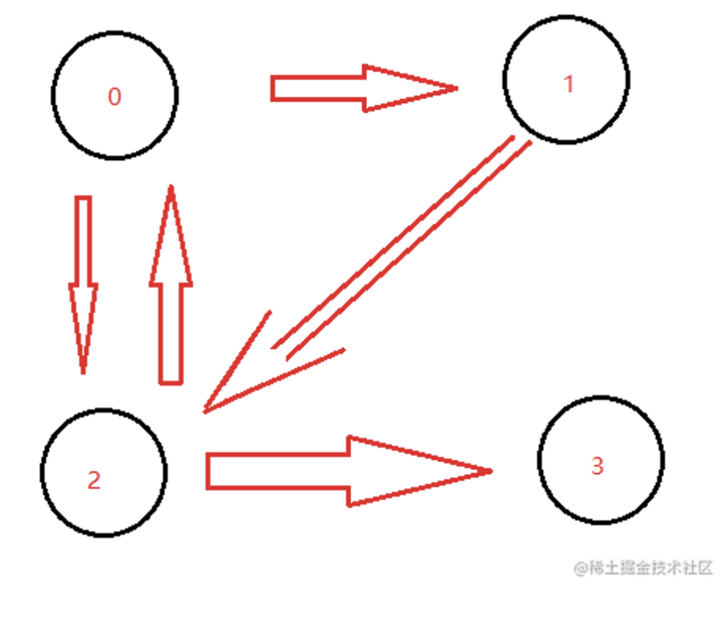

# 数据结构（Javascript表示）

## 栈

在JS中用数组实现

十进制转二进制

```jsx
// 时间复杂度 O(n) n为二进制的长度
// 空间复杂度 O(n) n为二进制的长度
const dec2bin = (dec) => {
  // 创建一个字符串
  let res = "";

  // 创建一个栈
  let stack = []

  // 遍历数字 如果大于0 就可以继续转换2进制
  while (dec > 0) {
    // 将数字的余数入栈
    stack.push(dec % 2);

    // 除以2
    dec = dec >> 1;
  }

  // 取出栈中的数字
  while (stack.length) {
    res += stack.pop();
  }

  // 返回这个字符串
  return res;
};
```

判断字符串的有效括号

```jsx
// 时间复杂度O(n) n为s的length
// 空间复杂度O(n)
const isValid = (s) => {

  // 如果长度不等于2的倍数肯定不是一个有效的括号
  if (s.length % 2 === 1) return false;

  // 创建一个栈
  let stack = [];

  // 遍历字符串
  for (let i = 0; i < s.length; i++) {

    const c = s[i];

    // 如果是左括号就入栈
    if (c === '(' || c === "{" || c === "[") {
      stack.push(c);
    } else {

      // 如果不是左括号 且栈为空 肯定不是一个有效的括号 返回false
      if (!stack.length) return false

      // 拿到最后一个左括号
      const top = stack[stack.length - 1];

      // 如果是右括号和左括号能匹配就出栈
      if ((top === "(" && c === ")") || (top === "{" && c === "}") || (top === "[" && c === "]")) {
        stack.pop();
      } else {

        // 否则就不是一个有效的括号
        return false
      }
    }

  }
  return stack.length === 0;
};
```

## 队列

在JS中用数组实现

BFS

## 链表

利用对象实现

手写instanceOf

```jsx
const myInstanceOf = (A, B) => {
  // 声明一个指针
  let p = A;
  
  // 遍历这个链表
  while (p) {
    if (p === B.prototype) return true;
    p = p.__proto__;
  }

  return false
}

myInstanceOf([], Object)
```

删除链表中的节点

```jsx
// 时间复杂和空间复杂度都是 O(1)
const deleteNode = (node) => {
  // 把当前链表的指针指向下下个链表的值就可以了
  node.val = node.next.val;
  node.next = node.next.next
}
```

删除链表中的重复元素

```jsx
// 1 -> 1 -> 2 -> 3 -> 3 
// 1 -> 2 -> 3 -> null

// 时间复杂度 O(n) n为链表的长度
// 空间复杂度 O(1)
const deleteDuplicates = (head) => {

  // 创建一个指针
  let p = head;

  // 遍历链表
  while (p && p.next) {

    // 如果当前节点的值等于下一个节点的值
    if (p.val === p.next.val) {

      // 删除下一个节点
      p.next = p.next.next
    } else {

      // 否则继续遍历
      p = p.next
    }
  }

  //  最后返回原来链表
  return head
}
```

反转链表

```jsx
// 1 -> 2 -> 3 -> 4 -> 5 -> null
// 5 -> 4 -> 3 -> 2 -> 1 -> null

// 时间复杂度 O(n) n为链表的长度
// 空间复杂度 O(1)
var reverseList = function (head) {

  // 创建一个指针
  let p1 = head;

  // 创建一个新指针
  let p2 = null;

  // 遍历链表
  while (p1) {

    // 创建一个临时变量
    const tmp = p1.next;

    // 将当前节点的下一个节点指向新链表
    p1.next = p2;

    // 将新链表指向当前节点
    p2 = p1;

    // 将当前节点指向临时变量
    p1 = tmp;
  }

  // 最后返回新的这个链表
  return p2;
}

reverseList(list
```

## 树

利用对象+数组实现

### 通用遍历

DFS

递归

```jsx
// 模版
function DFS(V){
	visited[V] === true
	for(W in V){
		if(visited[V] !== true){
			DFS()
		}
	}
}
```

BFS

队列 ：while队列有元素，出队，遍历依次入队

```jsx
// 模版
function BFS(V){
	visited[V] = true;
	Enqueue(V,Q)
	while(!IsEmpty(Q)){
		N = Dequeue(Q)
		for(W in N){
			visited[W] = true
			Enqueue(W,Q)
		}
	}
}
```

## 二叉树

利用【对象+数组】的方式

### 二叉树的遍历

其实前3种一般都有递归和非递归2种情况

1. 先序遍历

```jsx
// 先序遍历 递归
const preOrder = (tree) => {
  if (!tree) return

  console.log(tree.val);

  preOrder(tree.left);
  preOrder(tree.right);
}

// 先序遍历 非递归
const preOrder2 = (tree) => {
  if (!tree) return

  // 新建一个栈
  const stack = [tree];

  while (stack.length > 0) {
    const n = stack.pop();
    console.log(n.val);  // 1.根

    if (n.right) stack.push(n.right);  // 3.右
    if (n.left) stack.push(n.left);  // 2.左
  }
}
```

1. 中序遍历

```jsx
// 先序遍历 递归
const preOrder = (tree) => {
  if (!tree) return

  preOrder(tree.left);
  console.log(tree.val);
  preOrder(tree.right);
}

// 中序遍历 非递归
const inOrder2 = (tree) => {
  if (!tree) return;

  // 新建一个栈
  const stack = [];

  // 先遍历所有的左节点
  let p = tree;
  while (stack.length || p) {

    while (p) { // 优先左节点
      stack.push(p)
      p = p.left
    }

    const n = stack.pop(); // 取出当前节点
    console.log(n.val)； // 访问或操作

    p = n.right; // 拿出右节点
  }
}
```

1. 后序遍历

```jsx
// 先序遍历 递归
const preOrder = (tree) => {
  if (!tree) return

  preOrder(tree.left);
  console.log(tree.val);
  preOrder(tree.right);
}

// 后序遍历 非递归
const postOrder3 = (tree) => {
  if (!tree) return

  const stack = [tree];
  const outputStack = [];

	// 用了2个栈相互倒腾 从[根，右，左]到[左、右、根]
  while (stack.length) {
    const n = stack.pop(); // 根 右 左
    outputStack.push(n) // 根 右 左
    
    if (n.left) stack.push(n.left);
    if (n.right) stack.push(n.right);
  }

  while (outputStack.length) {
    const n = outputStack.pop(); // 左 右 根
    console.log(n.val);
  }
};
```

1. 层序遍历（其实就是BFS）

```jsx
const levelOrder = (tree)=>{
	if(!tree) return
	const queue = []
	queue.push(tree)
	while(queue.length > 0){
		let n = queue.shift()
		console.log(n.val)
		if(n.left) queue.push(n.left)
		if(n.right) queue.push(n.right)
	}
}

// 进阶：层序遍历，并将每一层遍历输出，如[[1],[2,3],[4,5,6,7]]
// 
const higherLevelOrder = (tree)=>{
	if(!tree) return
	const queue = []
	queue.push(tree)
	const res = []  // 
  
	while(queue.length > 0){
		let len = queue.length // 1
		res.push([]) 
		while(len--){ 
			const n = queue.shift()
			res[res.length - 1].push(n.val) // [[1]]
			if(n.left) queue.push(n.left)
			if(n.right) queue.push(n.right)
		}
	}
	return res
}
```

求二叉树的最大深度：

```jsx
// 给一个二叉树，需要你找出其最大的深度，从根节点到叶子节点的距离

// 时间复杂度 O(n) n为树的节点数
// 空间复杂度 有一个递归调用的栈 所以为 O(n) n也是为二叉树的最大深度
var maxDepth = function (root) {
  let res = 0;
    
  // 使用深度优先遍历
  const dfs = (n, l) => {
    if (!n) return;
    if (!n.left && !n.right) {
     // 没有叶子节点就把深度数量更新
      res = Math.max(res, l);
    }
    dfs(n.left, l + 1)
    dfs(n.right, l + 1)
  }

  dfs(root, 1)

  return res
}
```

求二叉树的最小深度：

```jsx
// 给一个二叉树，需要你找出其最小的深度， 从根节点到叶子节点的距离

// 时间复杂度O(n) n是树的节点数量
// 空间复杂度O(n) n是树的节点数量
var minDepth = function (root) {
  if (!root) return 0
  
  // 使用广度优先遍历
  const q = [[root, 1]];

  while (q.length) {
    // 取出当前节点
    const [n, l] = q.shift();
    
    // 如果是叶子节点直接返回深度就可
    if (!n.left && !n.right) return l
    if (n.left) q.push([n.left, l + 1]);
    if (n.right) q.push([n.right, l + 1]);
  }
}
```

## 图

图是**`网络结构的抽象模型`**, 是一组由边连接的节点

> js中可以利用**Object和Array构建图**



```jsx
// 生成数字关系图 只有状态为 3 5 6 的时候才为一个数字
const graph = {
  0: { 'blank': 0, 'sign': 1, ".": 2, "digit": 6 },
  1: { "digit": 6, ".": 2 },
  2: { "digit": 3 },
  3: { "digit": 3, "e": 4 },
  4: { "digit": 5, "sign": 7 },
  5: { "digit": 5 },
  6: { "digit": 6, ".": 3, "e": 4 },
  7: { "digit": 5 },
}

// 题目：根据输入字符串，每一个字符在Graph里面查找，查找的依据是当前索引下，以当前的字符作为第二索引，得到新的索引
// 再拿新的索引和新的字符继续找，直到找到的是索引undefined为止

// 时间复杂度 O(n) n是字符串长度
// 空间复杂度 O(1) 
var isNumber = function (s) {

  // 记录状态
  let state = 0;

  // 遍历字符串
  for (c of s.trim()) {
    // 把字符进行转换
    if (c >= '0' && c <= '9') {
      c = 'digit';
    } else if (c === " ") {
      c = 'blank';
    } else if (c === "+" || c === "-") {
      c = "sign";
    } else if (c === "E" || c === "e") {
      c = "e";
    }

    // 开始寻找图
    state = graph[state][c];

    // 如果最后是undefined就是错误
    if (state === undefined) return false
  }

  // 判断最后的结果是不是合法的数字
  if (state === 3 || state === 5 || state === 6) return true
  return false
};
```

## 堆

一种特殊的完全二叉树，分为最大堆和最小堆

最大堆：所有子树的根节点是子树中最大的值

最小堆：所有子树的根节点是子树中最小的值

> JS中通常使用数组来表示堆

父节点找子节点：

左侧子节点的位置：2*index + 1

右侧子节点的位置：2*index + 2

子节点找父节点：

```
Match.floor((index- 1)/2)
```

使用JS实现一个最小堆

```jsx
// JS实现最小堆
class MinHeap{
	constructor(){
		this.heap = []
	}
	// 交换节点的值
	swap(i1,i2){
		[this.heap[i1],this.heap[i2]] = [this.heap[i2],this.heap[i1]]
	}
	// 获取父节点
	getParentIndex(index){
		return (index - 1) >> 1 // 相等于 Math.floor((index - 1)/2)
	}
	// 获取左侧节点索引
	getLeftIndex(index){
		return (index << 1) + 1
	}
	// 获取右侧节点索引
	getRightIndex(){
		return (index << 1) + 2
	}
	// 获得堆顶元素
	peek(){
		return this.heap[0]
	}
	// 获取堆大小
	siez(){
		return this.heap.length
	}
	// 上移
	shiftUp(index){
		if( index === 0) return 
		// 获取父节点
		const parentIndex = this.getParentIndex(index)
		// 如果父节点的值大于当前节点的值，则需要交换
		if(this.heap[parentIndex] > this.heap[index]){
			this.swap(parentIndex,index)
			// 然后继续上移
			this.shiftUp(parentIndex)
		}
	}
	// 下移
	shiftDown(index){
		// 获取左右子节点索引
		const leftIndex = this.getLeftIndex(index);
		const rightIndex = this.getRightIndex(index);

		// 如果左节点小于当前的值
		if(this.heap[leftIndex] < this.heap[index]){
			this.swap(leftIndex,index)
			this.shiftDown(leftIndex)
		}
		// 如果右节点小于当前的值
		if(this.heap[rightIndex] < this.heap[index]){
			this.swap(leftIndex,index)
			this.shiftDown(leftIndex)
		}
	}
  // 删除堆顶元素，其实就是把最后一个元素放到堆顶，然后执行
	pop(){
		this.swap(0,this.size-1)
		this.shiftDown(0)
	}
	insert(value){
		// 插入到堆的底部
		this.heap.push(value)
		// 然后上移，直到父节点<=这个值
		this.shiftUp(this.heap.length - 1)
	}
}
```

数组中的第K个最大元素

```jsx
// 输入 [3,2,1,5,6,4] 和 k = 2
// 输出 5

// 时间复杂度 O(n * logK) K就是堆的大小
// 空间复杂度 O(K) K是参数k
var findKthLargest = function (nums, k) {

  // 使用上面js实现的最小堆类，来构建一个最小堆
  const h = new MinHeap();
  
  // 遍历数组
  nums.forEach(n => {
    
    // 把数组中的值依次插入到堆里
    h.insert(n);
    
    if (h.size() > k) {
      // 进行优胜劣汰
      h.pop();
    }
  })

  return h.peek()
};
```

前k个高频元素

```jsx
// nums = [1,1,1,2,2,3], k = 2
// 输出: [1,2]

// 时间复杂度 O(n * logK) 
// 空间复杂度 O(k)
var topKFrequent = function (nums, k) {

  // 统计每个元素出现的频率
  const map = new Map();

  // 遍历数组 建立映射关系
  nums.forEach(n => {
    map.set(n, map.has(n) ? map.get(n) + 1 : 1);
  })

  // 建立最小堆
  const h = new MinHeap();

  // 遍历映射关系
  map.forEach((value, key) => {

    // 由于插入的元素结构发生了变化，所以需要对 最小堆的类 进行改造一下,改造的方法我会写到最后
    h.insert({ value, key })
    if (h.size() > k) {
      h.pop()
    }
  })
  return h.peek().key
};

// 改造上移和下移操作即可
// shiftUp(index) {
//   if (index == 0) return;
//   const parentIndex = this.getParentIndex(index);
//   if (this.heap[parentIndex] && this.heap[parentIndex].value > this.heap[index].value) {
//     this.swap(parentIndex, index);
//     this.shiftUp(parentIndex);
//   }
// }
// shiftDown(index) {
//   const leftIndex = this.getLeftIndex(index);
//   const rightIndex = this.getRightIndex(index);

//   if (this.heap[leftIndex] && this.heap[leftIndex].value < this.heap[index].value) {
//     this.swap(leftIndex, index);
//     this.shiftDown(leftIndex)
//   }

//   if (this.heap[rightIndex] && this.heap[rightIndex].value < this.heap[index].value) {
//     this.swap(rightIndex, index);
//     this.shiftDown(rightIndex)
//   }
// }
```

## 集合（Set）

一种**无序且唯一**的数据结构

1.去重

```jsx
const arr = [1, 1, 1, 2, 2, 3];

// 去重
const arr2 = [...new Set(arr)];

// 判断元素是否在集合中
const set = new Set(arr);
set.has(2) // true

//  交集
const set2 = new Set([1, 2]);
const set3 = new Set([...set].filter(item => set.has(item)));
```

2.两个数组的交集

```jsx
// 时间复杂度 O(n^2) n为数组长度
// 空间复杂度 O(n)  n为去重后的数组长度
const intersection = (nums1, nums2) => {

  // 通过数组的filter选出交集
  // 然后通过 Set集合 去重 并生成数组
  return [...new Set(nums1.filter(item => nums2.includes(item)))];
}
```

## 字典（Map）

与集合类似，**`一个存储唯一值`**的结构,以**`键值对`**的形式存储

1.两数之和

```jsx
// nums = [2, 7, 11, 15] target = 9

// 时间复杂度O(n) n为nums的length
// 空间复杂度O(n)
var twoSum = function (nums, target) {

  // 建立一个字典数据结构来保存需要的值
  const map = new Map();
  for (let i = 0; i < nums.length; i++) {
  
    // 获取当前的值，和需要的值
    const n = nums[i];
    const n2 = target - n;
    
    // 如字典中有需要的值，就匹配成功
    if (map.has(n2)) {
      return [map.get(n2), i];
    } else {
    
    // 如没有，则把需要的值添加到字典中
      map.set(n, i);
    }
  }
};
```

2.两个数组的交集

```jsx
// nums1 = [1,2,2,1], nums2 = [2,2]
// 输出：[2]

// 时间复杂度 O(m + n) m为nums1长度 n为nums2长度
// 空间复杂度 O(m) m为交集的数组长度
const intersection = (nums1, nums2) => {
  // 创建一个字典
  const map = new Map();

  // 将数组1中的数字放入字典
  nums1.forEach(n => map.set(n, true));

  // 创建一个新数组
  const res = [];

  // 将数组2遍历 并判断是否在字典中
  nums2.forEach(n => {
    if (map.has(n)) {
      res.push(n);

      // 如果在字典中，则删除该数字
      map.delete(n);
    }
  })

  return res;
};
```

3.字符的有效括号

```jsx
// 用字典优化

// 时间复杂度 O(n) n为s的字符长度
// 空间复杂度 O(n) 
const isValid = (s) => {

  // 如果长度不等于2的倍数肯定不是一个有效的括号
  if (s.length % 2 !== 0) return false

  // 创建一个字典
  const map = new Map();
  map.set('(', ')');
  map.set('{', '}');
  map.set('[', ']');

  // 创建一个栈
  const stack = [];

  // 遍历字符串
  for (let i = 0; i < s.length; i++) {

    // 取出字符
    const c = s[i];

    // 如果是左括号就入栈
    if (map.has(c)) {
      stack.push(c)
    } else {

      // 取出栈顶
      const t = stack[stack.length - 1];

      // 如果字典中有这个值 就出栈
      if (map.get(t) === c) {
        stack.pop();
      } else {

        // 否则就不是一个有效的括号
        return false
      }

    }

  }

  return stack.length === 0;
};
```

4.最小覆盖子串

```jsx
// 输入：s = "ADOBECODEBANC", t = "ABC"
// 输出："BANC"

// 时间复杂度 O(m + n) m是t的长度 n是s的长度
// 空间复杂度 O(k) k是字符串中不重复字符的个数
var minWindow = function (s, t) {
  // 定义双指针维护一个滑动窗口
  let l = 0;
  let r = 0;

  // 建立一个字典
  const need = new Map();

  //  遍历t
  for (const c of t) {
    need.set(c, need.has(c) ? need.get(c) + 1 : 1)
  }

  let needType = need.size

  // 记录最小子串
  let res = ""

  // 移动右指针
  while (r < s.length) {
  
    // 获取当前字符
    const c = s[r];

    // 如果字典里有这个字符
    if (need.has(c)) {
    
      // 减少字典里面的次数
      need.set(c, need.get(c) - 1);

      // 减少需要的值
      if (need.get(c) === 0) needType -= 1;
    }

    // 如果字典中所有的值都为0了 就说明找到了一个最小子串
    while (needType === 0) {
    
      // 取出当前符合要求的子串
      const newRes = s.substring(l, r + 1)

      // 如果当前子串是小于上次的子串就进行覆盖
      if (!res || newRes.length < res.length) res = newRes;

      // 获取左指针的字符
      const c2 = s[l];

      // 如果字典里有这个字符
      if (need.has(c2)) {
        // 增加字典里面的次数
        need.set(c2, need.get(c2) + 1);

        // 增加需要的值
        if (need.get(c2) === 1) needType += 1;
      }
      l += 1;
    }
    r += 1;
  }
  return res
};
```

