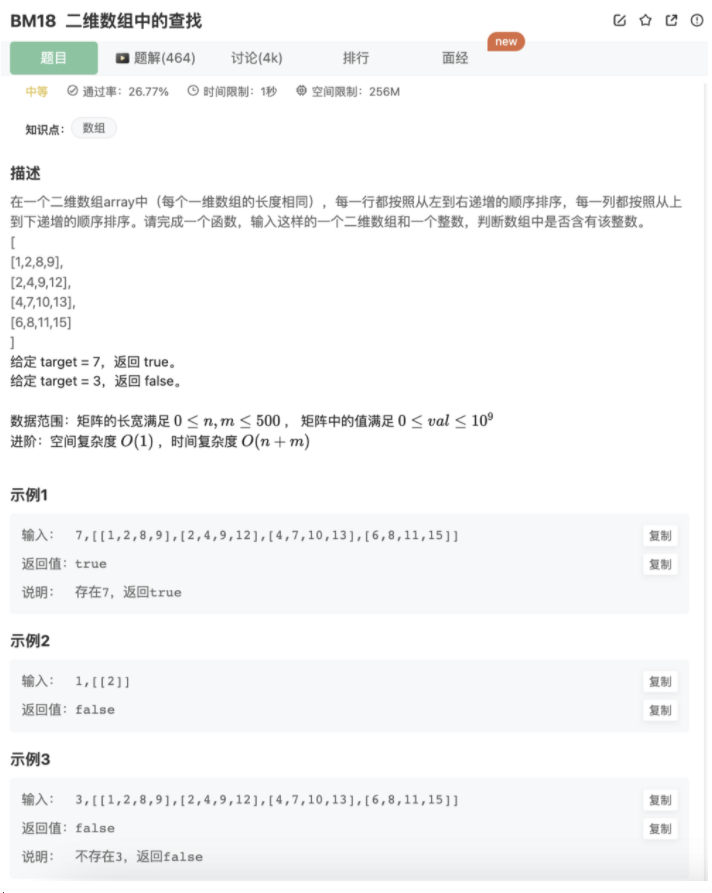

# 二维数组中的查找

## 题目



## 思路

1.暴力搜索

时间复杂度：O(MN)

空间复杂度：O(1)

2.遍历每一行,对每一行使用二分搜索

时间复杂度：O(MlogN)

空间复杂度：O(1)

3.观察题目，根据规律找到突破口

题目所提供的矩阵，是一种特殊的矩阵，称作杨氏矩阵，其有特定的查找算法(左下或者右上作为起始点2分查找)

每一行从左到右递增

每一列从上到下递增

左上角最小，右下角最大

思路：左下角（其实右上角也可以）开始，小的往上走，大的往右走，直到找到或者到达边界

事实上，这其实也是一种二分法，每次比较后会淘汰掉当前行或者列

时间复杂度：O(M+N)

空间复杂度：O(1)

## 代码

```jsx
function Find(target, array)
{
    if(!array || array.length === 0 || array[0].length===0) return false
    // 思路：杨氏矩阵二分查找
    let row = array.length-1
    let col = 0
    while(row >= 0 && col <= array[0].length-1){
        let st = array[row][col]
        if(target>st){
            col++ 
        }else if(target<st){
            row--
        }else if(target==st){
            return true
        }
    }
    return false
}
module.exports = {
    Find : Find
};
```