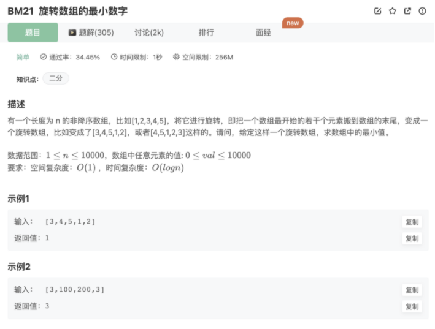

# 旋转数组的最小数字

## 题目



## 思路

由于AB（非降序）旋转后变成BA（B有序，A有序）

步骤：

1.初始化：声明left和right指针指向数组两端

2.循环二分`while(left ≠ right)` :

mid为中点，分为3种情况去缩小区间

1- array[m] > array[right]时，`left = mid`，缩小区间为[mid+1,right]

2- array[m] < array[right]时，`right = mid` ，缩小区间为[left,mid]

3- array[m] == array[right]时，其实左右区间都有可能（比如 99999129和9912999999），这时候的策略是不断缩小right，直到right的值有改变或者mid==right，判定左边还是右边去缩小

## 代码

```jsx
function minNumberInRotateArray(rotateArray)
{
    if(rotateArray.length == 1) return rotateArray[0]
    let left = 0
    let right = rotateArray.length-1
    while(left != right){
        console.log(left,right)
        let mid = Math.floor((left + right)/2) // 
        if(rotateArray[mid] > rotateArray[right]){
            left = mid+1
        }else if(rotateArray[mid] < rotateArray[right]){
            right = mid
        }else if(rotateArray[mid] == rotateArray[right]){
            let oldRight = rotateArray[right]
            right--
            while(rotateArray[right] == oldRight && right != mid){
                console.log(right)
                right--
            }
            if(rotateArray[right] != oldRight){
                left = mid
            }
            if(right == mid){
                right = mid
            }
        }
    }
    return rotateArray[left]
}
module.exports = {
    minNumberInRotateArray : minNumberInRotateArray
};
```

