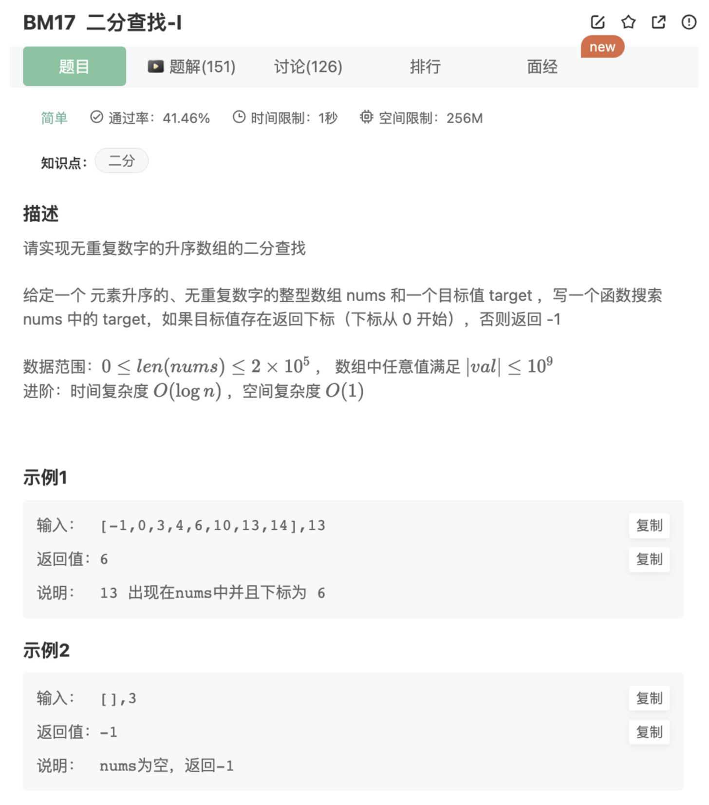

# 二分查找-I

## 题目



## 代码

```jsx
/**
 * 代码中的类名、方法名、参数名已经指定，请勿修改，直接返回方法规定的值即可
 * @param nums int整型一维数组 
 * @param target int整型 
 * @return int整型
 */
function search( nums ,  target ) {
    if(nums.length === 0 ) return -1
    // 二分查找
    let left = 0 
    let right = nums.length-1
    while(left <= right){
        let mid = Math.floor((left + right)/2)
        console.log(mid)
        if(target < nums[mid]){
            right = mid - 1
        }else if(target > nums[mid]){
            left = mid + 1
        }else if(target === nums[mid]){
            return mid
        }
    }
    return -1
}
module.exports = {
    search : search
};
```