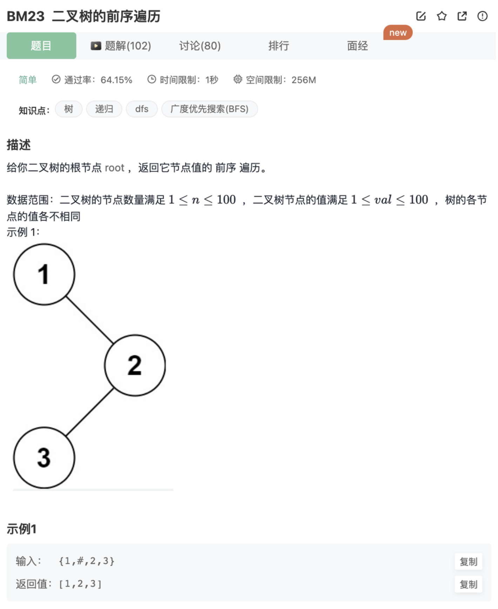

# 二叉树的前序遍历

## 题目




## 代码

### 递归

```jsx
/**
 * 代码中的类名、方法名、参数名已经指定，请勿修改，直接返回方法规定的值即可
 * @param root TreeNode类 
 * @return int整型一维数组
 */
function preorderTraversal( root ) {
    if(!root) return []
    // 前序遍历（根左右）-递归
    let res = []
    function recursionTree(res,root){
        if(!root) return 
        res.push(root.val)
        recursionTree(res,root.left)
        recursionTree(res,root.right)
    }
    recursionTree(res,root)
    return res
}
```

### 非递归

利用辅助栈，注意区别层序遍历的BFS（辅助堆）

```jsx
/**
 * 代码中的类名、方法名、参数名已经指定，请勿修改，直接返回方法规定的值即可
 * @param root TreeNode类 
 * @return int整型一维数组
 */
function preorderTraversal( root ) {
    if(!root) return []
    // 前序遍历（根左右）-递归
    let res = []
    function traverseTreeBystack(res,root){
        let stack = []
        stack.push(root)
        while(stack.length){
            let curNode = stack.pop()
            res.push(curNode.val)
            if(curNode.right) stack.push(curNode.right)
            if(curNode.left) stack.push(curNode.left)
        }
    }
    traverseTreeBystack(res,root)
    return res
}
```