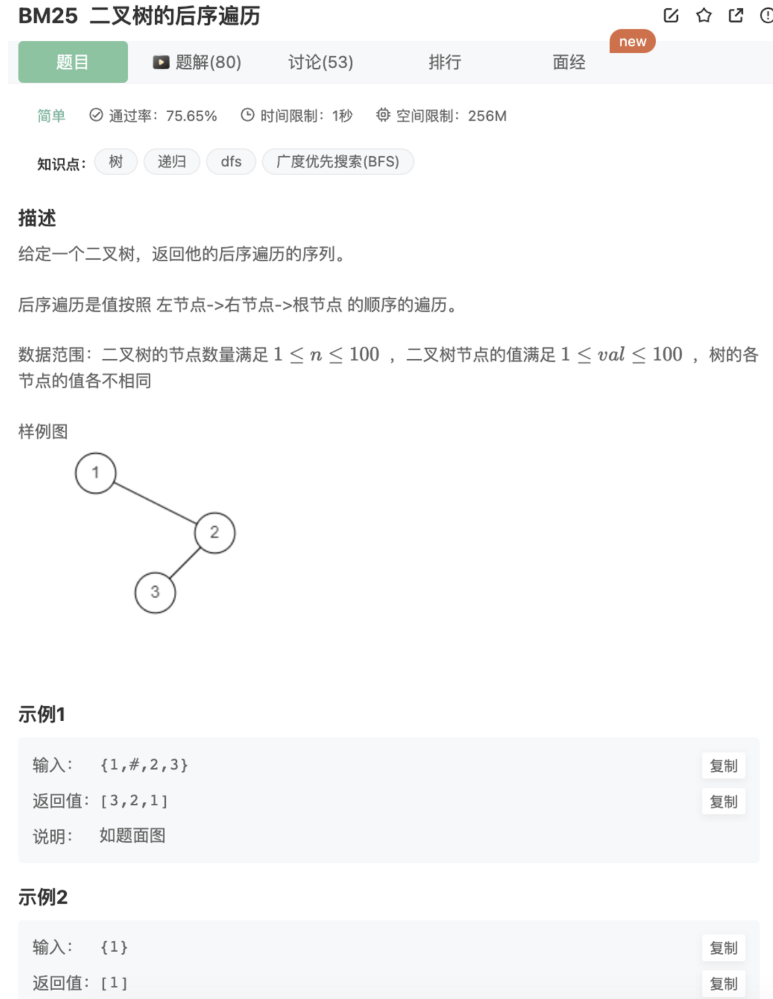

# 二叉树的后序遍历

## 题目



## 代码

递归

```jsx
/**
 * 代码中的类名、方法名、参数名已经指定，请勿修改，直接返回方法规定的值即可
 * @param root TreeNode类 
 * @return int整型一维数组
 */
function postorderTraversal( root ) {
    // 后序遍历（左右根）-递归
    let res = []
    function recursionTree(res,root){
        if(!root) return 
        recursionTree(res,root.left)
        recursionTree(res,root.right)
        res.push(root.val)
    }
    recursionTree(res,root)
    return res
}
```

非递归

```jsx
function postorderTraversal( root ) {
    if(!root) return []
    // 后序遍历（左右根）- 非递归
    let res = []
    function traverseTreeBystack(res,root){
        let stack = []
        let pre = null
        while(root!=null || stack.length){
            // 优先左节点
            while(root!=null){
                stack.push(root)
                root = root.left
            }
            // 弹出栈顶
            let node = stack.pop()
            // 元素没有右节点或是已经访问过，才访问
            if(node.right == null || node.right == pre){
                // 访问中间的节点
                res.push(node.val)
                // 且记录为访问过了
                pre = node
            }else{ // 有右节点且没有访问过
                stack.push(node)
                // 先访问右边
                root = node.right
            }
        }
    }
    traverseTreeBystack(res,root)
    return res
}
```