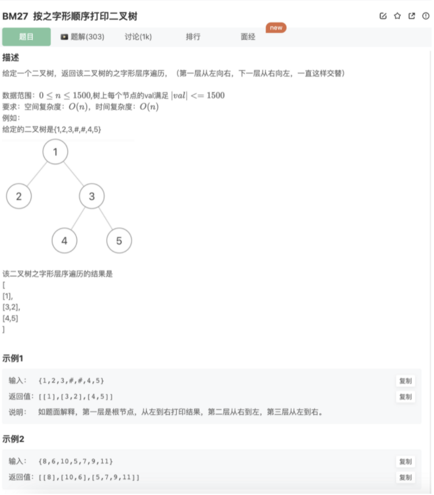

# 按之字形顺序打印二叉树

## 题目




## 代码

其实就是BM26层序遍历做了一点小改动

```jsx
/**
  * @param root TreeNode类 
  * @return int整型二维数组
  */
function levelOrder( root ) {
   if(!root) return []
    let res = []
    // 所谓层序遍历，其实就是BFS，这里还增加了一个难点--需要按层划分，并且将该层输入进一个数组
    function traverse(res,root){
      if(!root) return 
      let layer = []
      layer.push(root)
      let flag = false // flag为true代表奇数
      while(layer.length){
				flag = 
        let row = []
        let n = layer.length
        // 把这一层都遍历完，同时新加入下一层的结点
        for(let i=0;i<n;i++){
            let curNode = layer.shift()
            row.push(curNode.val)
            if(curNode.left){
                layer.push(curNode.left)
            } 
            if(curNode.right){
                layer.push(curNode.right)
            } 
        }
        if(
        res.push(row)
      }
    }
    traverse(res,root)
    return res
}
```

另外一种统计每一层的方式

```jsx
function Print(pRoot)
{
   if(!pRoot) return []
    let res = []
    // 所谓层序遍历，其实就是BFS，这里还增加了一个难点--需要按层划分，并且将该层输入进一个数组
    function traverse(res,root){
      if(!root) return 
      let queue = []
      let layer = []
      let last = root // 标记每一层最后一个元素
      let tail = root // 记录当前最后元素，当进入每一次层最后的元素的时候，将其作为下一层的最后元素（last = tail）
      queue.push(root)
      // 一层一层统计
      while(queue.length){
        let curNode = queue.shift()
        layer.push(curNode.val)
        if(curNode.left){
          queue.push(curNode.left)
          tail = curNode.left
        } 
        if(curNode.right){
          queue.push(curNode.right)
          tail = curNode.right
        } 
        console.log(curNode,last)
        // 当前遍历的元素是当前层最后的元素
        if(curNode === last){ 
          res.push(layer) // 该层元素数组推入结果数组
          last = tail // 重新选新的下一层的最后元素
          layer = [] // 清空下一层的元素数组
        }
      }
    }
    // 
    function ZPrint(arr){
        for(let i=0;i<arr.length;i++){
            if(i%2 === 1){
                arr[i].reverse()
            }
        }
    }

    traverse(res,pRoot)
    ZPrint(res)
    return res
}
```