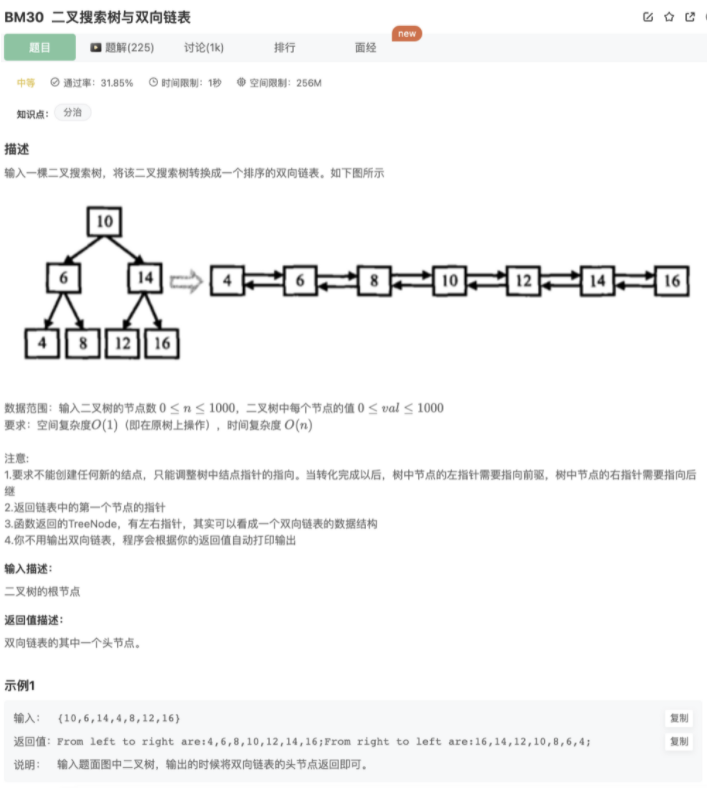

# 二叉搜索树与双向链表

## 题目



## 代码

中序遍历 + 辅助数组

```jsx
/* function TreeNode(x) {
    this.val = x;
    this.left = null;
    this.right = null;
} */
function Convert(pRootOfTree)
{
    let listArr = []
    // DFS
    function DFSSearch(pRootOfTree){
        if(!pRootOfTree) return 
        DFSSearch(pRootOfTree.left)
        listArr.push(pRootOfTree)
        DFSSearch(pRootOfTree.right)
    }
    DFSSearch(pRootOfTree)
    // 加入null，方便处理
    listArr.push(null)
    listArr.unshift(null)
    
    for(let i=1;i<listArr.length-1;i++){
        listArr[i].left = listArr[i-1]
        listArr[i].right = listArr[i+1]
    }
    console.log(listArr[1])
    return listArr[1]
}
```

中序遍历 + 链表连接

```jsx
/* function TreeNode(x) {
    this.val = x;
    this.left = null;
    this.right = null;
} */
function Convert(pRootOfTree)
{
    let head = null
    let pre = null
    // DFS中序遍历(左根右),遍历的时候能拿到当前结点，前后连接即可
    function DFSSearch(pRootOfTree){
        if(!pRootOfTree) return 
        DFSSearch(pRootOfTree.left)
        // 找到最小值，初始化head和pre
        if(pre == null){
            head = pRootOfTree
            pre = pRootOfTree
        }
        // 当前节点与上一节建立连接，将pre设置为当前值
        else{
            pre.right = pRootOfTree
            pRootOfTree.left = pre
            pre = pRootOfTree
        }
        DFSSearch(pRootOfTree.right)
    }
    DFSSearch(pRootOfTree)
    return head
}
```

## 其他思路

辅助栈

```java
import java.util.*;
public class Solution {
    public TreeNode Convert(TreeNode pRootOfTree) {
        if (pRootOfTree == null)
            return null;
        //设置栈用于遍历
        Stack<TreeNode> s = new Stack<TreeNode>(); 
        TreeNode head = null;
        TreeNode pre = null;
        // 确认第一个遍历到最左，即为首位
        boolean isFirst = true; 
        while(pRootOfTree != null || !s.isEmpty()){
            //直到没有左节点
            while(pRootOfTree != null){  
                s.push(pRootOfTree);
                pRootOfTree = pRootOfTree.left;
            }
            pRootOfTree = s.pop();
            //最左元素即表头
            if(isFirst){  
                head = pRootOfTree;
                pre = head;
                isFirst = false;
            //当前节点与上一节点建立连接，将pre设置为当前值
            }else{  
                pre.right = pRootOfTree;
                pRootOfTree.left = pre;
                pre = pRootOfTree;
            }
            pRootOfTree = pRootOfTree.right;
        }
        return head;
    }
}
```