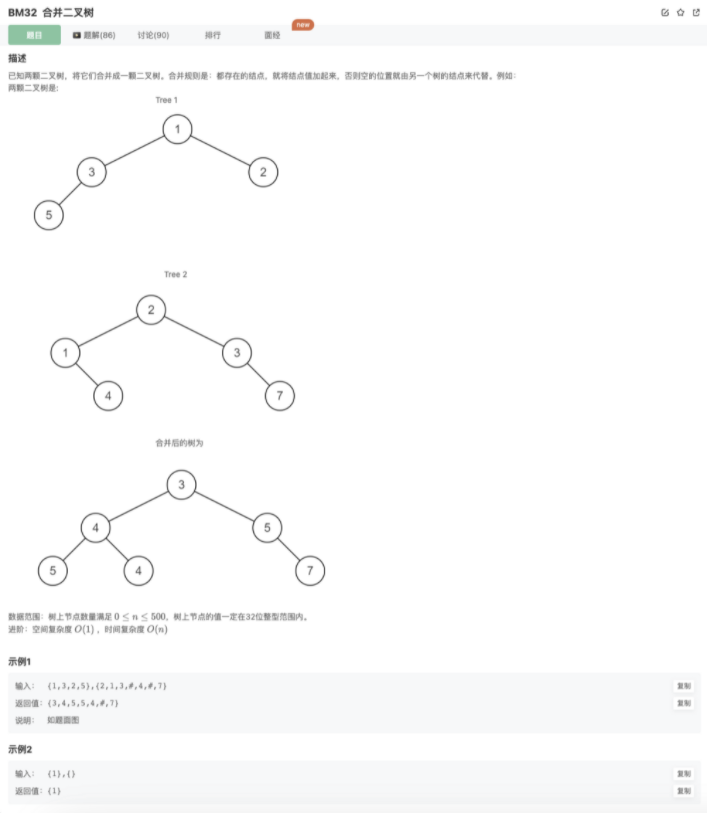
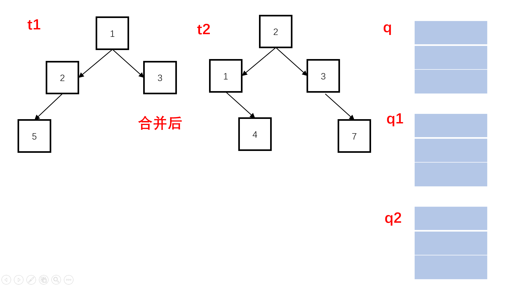

# 合并二叉树

## 题目



## 代码

```jsx
/**
 * @param t1 TreeNode类 
 * @param t2 TreeNode类 
 * @return TreeNode类
 */
function mergeTrees( t1 ,  t2 ) {
    function recursion(node1,node2){
        if(!node1){
            return node2
        }
        if(!node2){
            return node1
        }
        let head = new TreeNode(node1.val + node2.val)
        head.left = recursion(node1.left,node2.left)
        head.right = recursion(node1.right,node2.right)
        return head
    }
```

## 其他思路

辅助队列



```java
/**
 * @param t1 TreeNode类 
 * @param t2 TreeNode类 
 * @return TreeNode类
 */
function mergeTrees( t1 ,  t2 ) {
    function recursion(node1,node2){
        if(!node1){
            return node2
        }
        if(!node2){
            return node1
        }
        let head = new TreeNode(node1.val + node2.val)
        head.left = recursion(node1.left,node2.left)
        head.right = recursion(node1.right,node2.right)
        return head
    }
```