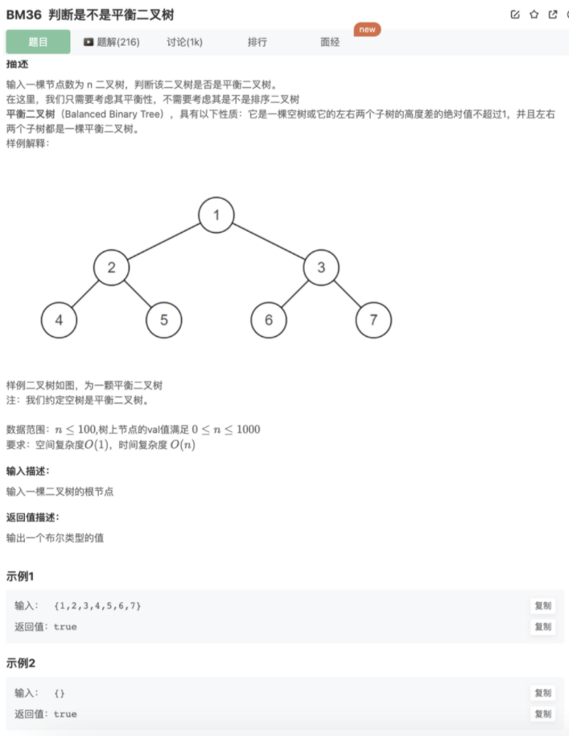

# 判断是不是平衡二叉树

## 题目



## 思路

基于[BM28 二叉树的最大深度(*)](https://www.notion.so/BM28-1e80c6e4b24e48d495fd1cbfc7af03a5) 去写这道题

按照题意：拿到左右子树高度的差的绝对值，大于1则为false

## 代码

```jsx
function IsBalanced_Solution(pRoot)
{
    let res = true
    function findHeight(node){
        if(!node) return 0
        let leftHeight = findHeight(node.left)
        let rightHeight = findHeight(node.right)
        if(Math.abs(leftHeight-rightHeight) > 1) res = false
        return Math.max(leftHeight,rightHeight) + 1
    }
    findHeight(pRoot)
    return res
}
```