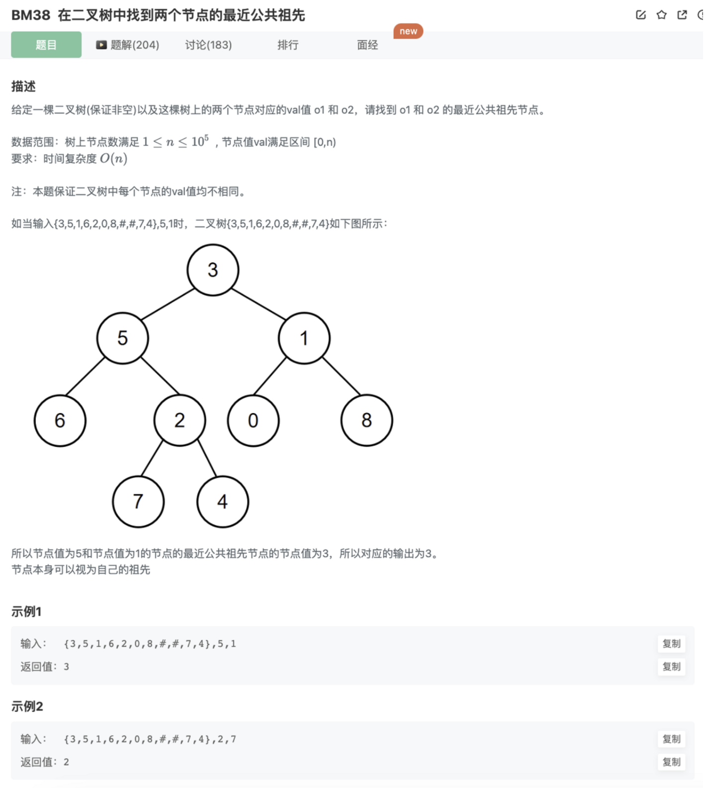

# 二叉树的最近公共祖先

## 题目



思路：

在[BM37 二叉搜索树的最近公共祖先(*)](https://www.notion.so/BM37-5bcdf58ed2ef4e719ddc39a7069a54de) 的基础上去拓展去找

1.辅助路径数组

利用遍历，这里用DFS，在递进的过程中加入数组，找到则标记提前退出剩余节点的查找，回溯的过程中踢出

```jsx
function findPath(node,val,arr){
    if(!node || flag) return 
    arr.push(node)
    if(node.val == val){ 
        flag = true 
        return 
    }
    findPath(node.left,val,arr)
    findPath(node.right,val,arr)
    if(flag) return 
    arr.pop()
}
```

由上面的方法找出经过的路径节点数组

2者从头开始找共同的结点，最后一个共同的结点就是最近公共祖先

```jsx
function comparePath(root,o1,o2){
    let path1 = []
    let path2 = []
    findPath(root,o1,path1)
    flag = false
    findPath(root,o2,path2)
    let same = path1[0]
    // 2者从头开始找共同的结点，最后一个共同的结点就是最近公共祖先
    for(let i=0;i<path1.length && i<path2.length;i++){
        if(path1[i].val === path2[i].val){
            same = path1[i]
        }else{
            break
        }
    }
    return same.val
}
```

2.二叉树递归(*)

1.如果o1和o2的一个

2.如果都不匹配，则分别递归左右子树

3.如果有一个节点出现在左子树，并且另外一个节点出现在右子树，则root就是最近公共祖先

4.如果两个节点都出现在左子树，则说明最低公共祖先先在左子树中，否则在右子树

5.继续递归左右子树，直到遇到step1或者step3的情况

```jsx
/**
 * @param root TreeNode类 
 * @param o1 int整型 
 * @param o2 int整型 
 * @return int整型
 */
function lowestCommonAncestor( root ,  o1 ,  o2 ) {
    // 二叉树递归
    if(root == null) return -1
    // 该节点是其中某一个节点
    if(root.val === o1 || root.val === o2) return root.val
    // 左子树寻找公共祖先
    let left = lowestCommonAncestor(root.left,o1,o2)
    // 右子树寻找公共祖先
    let right = lowestCommonAncestor(root.right,o1,o2)
    // 左子树为没找到，则在右子树中
    if(left == -1) return right
    // 右子树没找到，则在左子树中
    if(right == -1) return left
    // 否则是当前节点
    return root.val
}
```

## 代码

1.辅助数组记录路径

```jsx
/**
 * @param root TreeNode类 
 * @param o1 int整型 
 * @param o2 int整型 
 * @return int整型
 */
function lowestCommonAncestor( root ,  o1 ,  o2 ) {
    let flag = false
    function findPath(node,val,arr){
        if(!node || flag) return 
        arr.push(node)
        if(node.val == val){ 
            flag = true 
            return 
        }
        findPath(node.left,val,arr)
        findPath(node.right,val,arr)
        if(flag) return 
        arr.pop()
    }

    function comparePath(root,o1,o2){
        let path1 = []
        let path2 = []
        findPath(root,o1,path1)
        flag = false
        findPath(root,o2,path2)
        let same = path1[0]
        // 2者从头开始找共同的结点，最后一个共同的结点就是最近公共祖先
        for(let i=0;i<path1.length && i<path2.length;i++){
            if(path1[i].val === path2[i].val){
                same = path1[i]
            }else{
                break
            }
        }
        return same.val
    }
    return comparePath(root,o1,o2)
}
```

2.二叉树递归(*)

```java
/**
 * @param root TreeNode类 
 * @param o1 int整型 
 * @param o2 int整型 
 * @return int整型
 */
function lowestCommonAncestor( root ,  o1 ,  o2 ) {
    // 二叉树递归
    if(root == null) return -1
    // 该节点是其中某一个节点
    if(root.val === o1 || root.val === o2) return root.val
    // 左子树寻找公共祖先
    let left = lowestCommonAncestor(root.left,o1,o2)
    // 右子树寻找公共祖先
    let right = lowestCommonAncestor(root.right,o1,o2)
    // 左子树为没找到，则在右子树中
    if(left == -1) return right
    // 右子树没找到，则在左子树中
    if(right == -1) return left
    // 否则是当前节点
    return root.val
}
```