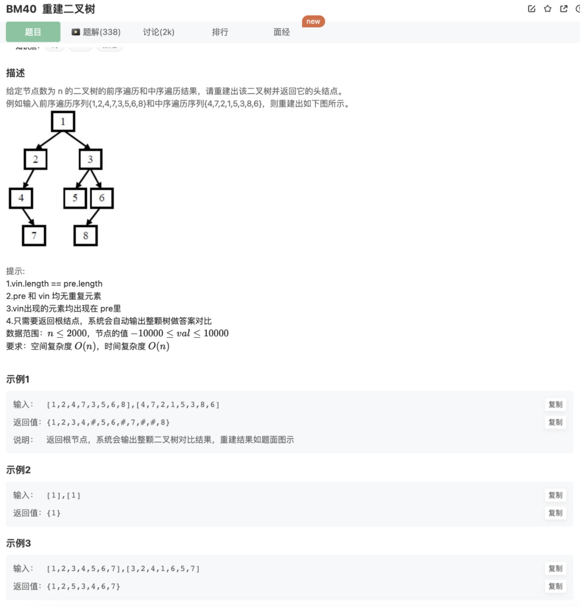
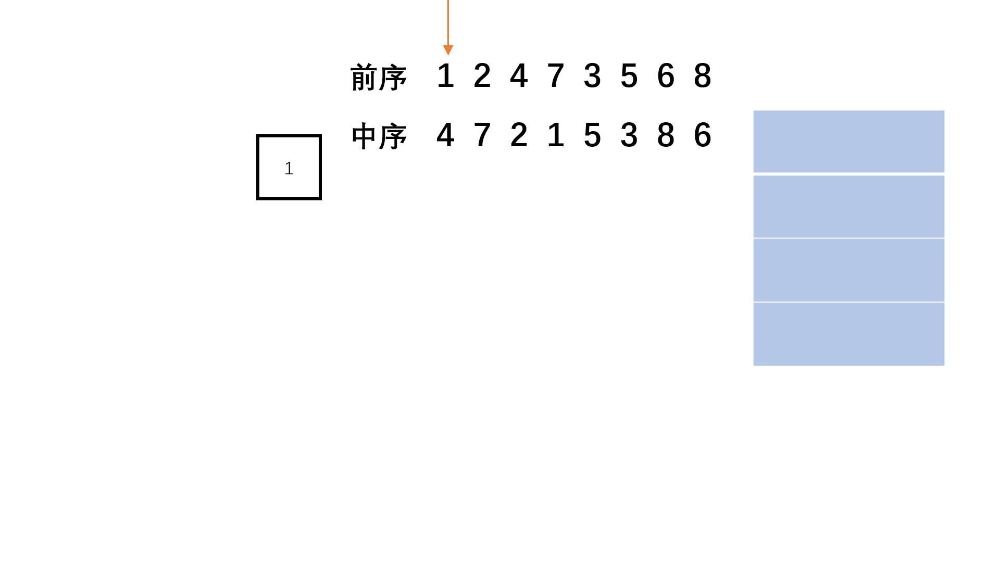

# 重建二叉树

## 题目




## 代码

思路：

找到规律，递归处理

```jsx
/* function TreeNode(x) {
    this.val = x;
    this.left = null;
    this.right = null;
} */
function reConstructBinaryTree(pre, vin)
{
    // 根左右和左根右 确定【根】和左右子树的范围
    // 根据【根左右】的特点，递归确定【根.left】和【根.right】的值
    // 对左右重复上述过程，直到左右的数目为1或者为空

    // 代码
    function recursionList(pre,vin){
        // 递归终止条件：空元素和只有一个元素
        if(pre.length === 1) return new TreeNode(pre[0])
        if(pre.length === 0 || vin.length === 0 ) return null 
        let rootIndex = vin.findIndex((item)=>item === pre[0])
        // 中序遍历的左右子树
        let middleLeftList = vin.slice(0,rootIndex)
        let middleRightList = vin.slice(rootIndex+1)
        // 前序遍历的左右子树
        let frontLeftList = pre.slice(1,middleLeftList.length+1)
        let frontRightList = pre.slice(-middleRightList.length)
        // 构建
        let root = new TreeNode(pre[0])
        root.left = recursionList(frontLeftList,middleLeftList)
        root.right = recursionList(frontRightList,middleRightList)
        return root
    }
    return recursionList(pre,vin)
}
```

## 其他思路

除了递归，我们也可以用类似非递归前序遍历的方式建立二叉树，利用栈辅助进行非递归，然后依次建立节点。

- step 1：首先前序遍历第一个数字依然是根节点，并建立栈辅助遍历。
- step 2：然后我们就开始判断，在前序遍历中相邻的两个数字必定是只有两种情况：要么前序后一个是前一个的左节点；要么前序后一个是前一个的右节点或者其祖先的右节点。
- step 3：我们可以同时顺序遍历pre和vin两个序列，判断是否是左节点，如果是左节点则不断向左深入，用栈记录祖先，如果不是需要弹出栈回到相应的祖先，然后进入右子树，整个过程类似非递归前序遍历。



```java
import java.util.*;
public class Solution {
    public TreeNode reConstructBinaryTree(int [] pre,int [] vin) {
        int n = pre.length;
        int m = vin.length;
        //每个遍历都不能为0
        if(n == 0 || m == 0) 
            return null;
        Stack<TreeNode> s = new Stack<TreeNode>();
        //首先建立前序第一个即根节点
        TreeNode root = new TreeNode(pre[0]); 
        TreeNode cur = root;
        for(int i = 1, j = 0; i < n; i++){
            //要么旁边这个是它的左节点
            if(cur.val != vin[j]){ 
                cur.left = new TreeNode(pre[i]);
                s.push(cur);
                //要么旁边这个是它的右节点，或者祖先的右节点
                cur = cur.left; 
            }else{
                j++;
                //弹出到符合的祖先
                while(!s.isEmpty() && s.peek().val == vin[j]){
                    cur = s.pop();
                    j++;
                }
                //添加右节点
                cur.right = new TreeNode(pre[i]); 
                cur = cur.right;
            }
        }
        return root;
    }
}
```