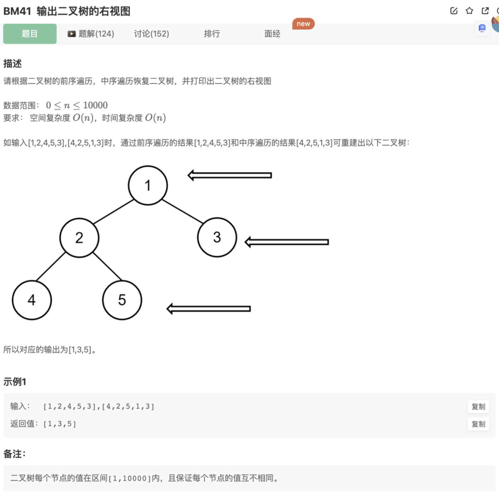

# 输出二叉树的右视图

## 题目




## 代码

## 代码

```jsx
/**
 * 代码中的类名、方法名、参数名已经指定，请勿修改，直接返回方法规定的值即可
 * 求二叉树的右视图
 * @param xianxu int整型一维数组 先序遍历
 * @param zhongxu int整型一维数组 中序遍历
 * @return int整型一维数组
 */
function solve( xianxu ,  zhongxu ) {
    // 重建二叉树
    function rebuildTree(pre,vin){
        // 递归终止条件：空元素和只有一个元素
        if(pre.length === 1) return new TreeNode(pre[0])
        if(pre.length === 0 || vin.length === 0 ) return null 
        let rootIndex = vin.findIndex((item)=>item === pre[0])
        // 中序遍历的左右子树
        let middleLeftList = vin.slice(0,rootIndex)
        let middleRightList = vin.slice(rootIndex+1)
        // 前序遍历的左右子树
        let frontLeftList = pre.slice(1,middleLeftList.length+1)
        let frontRightList = pre.slice(-middleRightList.length)
        // 构建
        let root = new TreeNode(pre[0])
        root.left = rebuildTree(frontLeftList,middleLeftList)
        root.right = rebuildTree(frontRightList,middleRightList)
        return root
    }
    // 对二叉树进行按层层序遍历
    function traverse(tree){
        // BFS
        let rowRes = []
        let layer = [tree]
        while(layer.length){
            let row = []
            let n = layer.length
            for(let i=0;i<n;i++){
                let cur = layer.shift()
                row.push(cur.val)
                if(cur.left) layer.push(cur.left)
                if(cur.right) layer.push(cur.right)
            }
            rowRes.push(row)
        }
        let res = []
        rowRes.forEach((item)=>{
            res.push(item[item.length-1])
        })
        return res
    }
    let tree = rebuildTree(xianxu ,  zhongxu)
    let result = traverse(tree)
    return result
}
```