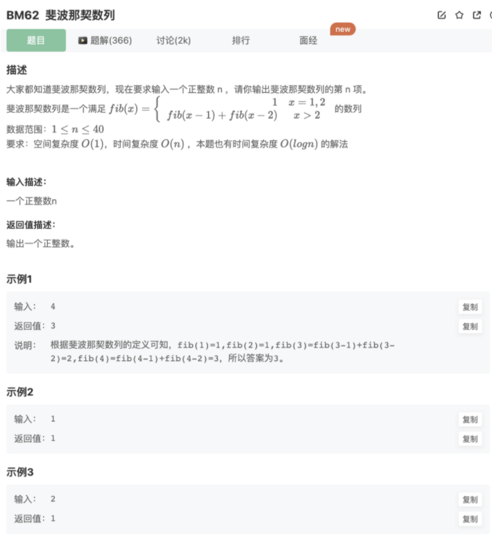

# 斐波拉契数列

## 题目



## 代码

```jsx
function Fibonacci(n)
{
    let arr = []
    arr[1] = 1
    arr[2] = 1
    for(let i=3;i<=n;i++){
        arr[i] = arr[i-1] + arr[i-2]
    }
    return arr[n]

}
module.exports = {
    Fibonacci : Fibonacci
};
```