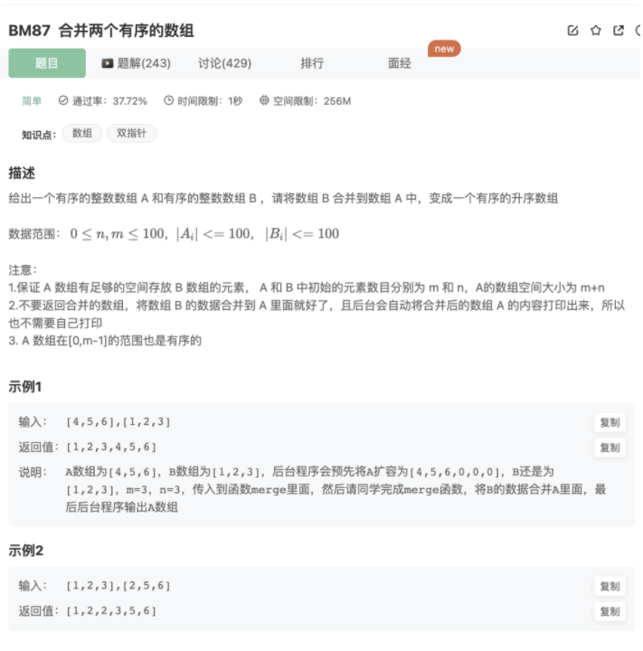

# 合并2个有序数组

## 题目




## 代码

```jsx
/**
 * 
 * @param A int整型一维数组 
 * @param B int整型一维数组 
 * @return void
 */
function merge( A, m, B, n ) {
    // 双指针移动插入
    let left = 0
    let right = 0
    while(left < A.length || right < B.length){
        if(A[left]!==undefined && B[right]!==undefined){
            if(A[left] >= B[right]){
                A.splice(left,0,B[right])
                right++
                left++
            }else{
                left++
            }
        }else{
            B.slice(right).forEach((item)=>{
                A.push(item)
            })
            break
        }
    }
}
module.exports = {
    merge : merge
};
```