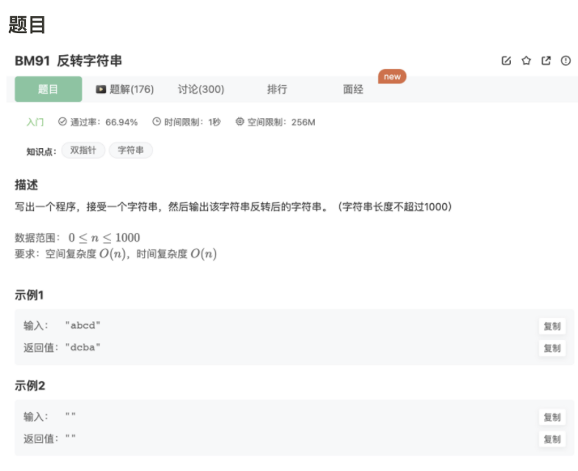

# 反转字符串

## 题目




## 代码

```jsx
/**
 * 反转字符串
 * @param str string字符串 
 * @return string字符串
 */
function solve( str ) {
    let res = []
    let pt1 = 0
    let pt2 = str.length-1
    while(pt2>=0){
        res[pt1] = str[pt2]
        pt1++
        pt2--
    }
    return res.join('')
}
module.exports = {
    solve : solve
};
```