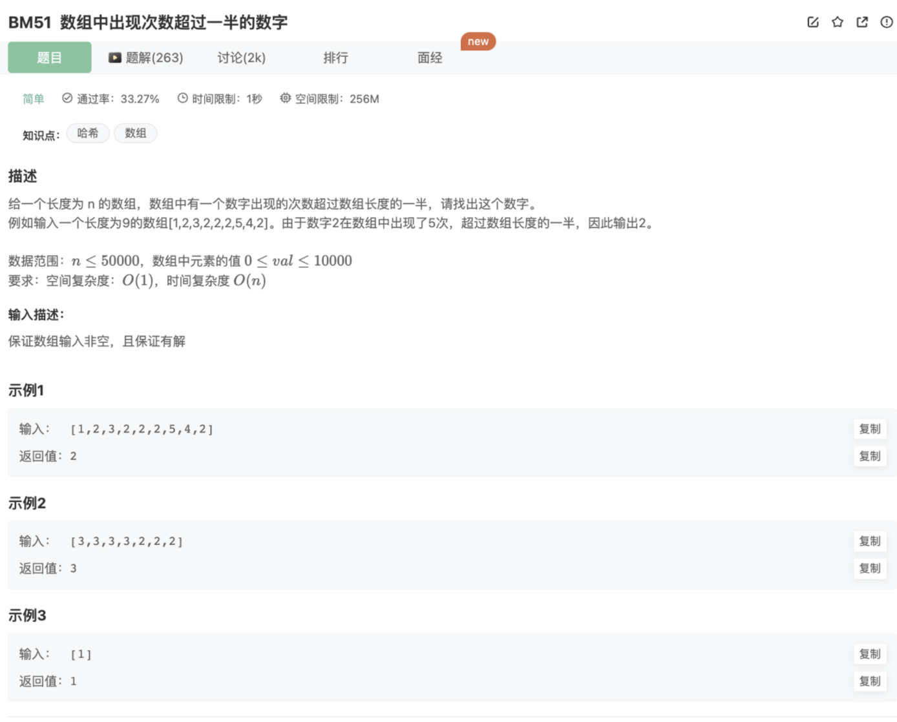

# 数组中出现次数超过一半的数字

## 题目




## 代码

```jsx
function MoreThanHalfNum_Solution(numbers)
{
    let hash = {}
    for(let i=0;i<numbers.length;i++){
        hash[numbers[i]] = hash[numbers[i]] ? hash[numbers[i]]+1 : 1
        if(hash[numbers[i]] > numbers.length/2) return numbers[i]
    }
}
module.exports = {
    MoreThanHalfNum_Solution : MoreThanHalfNum_Solution
};
```