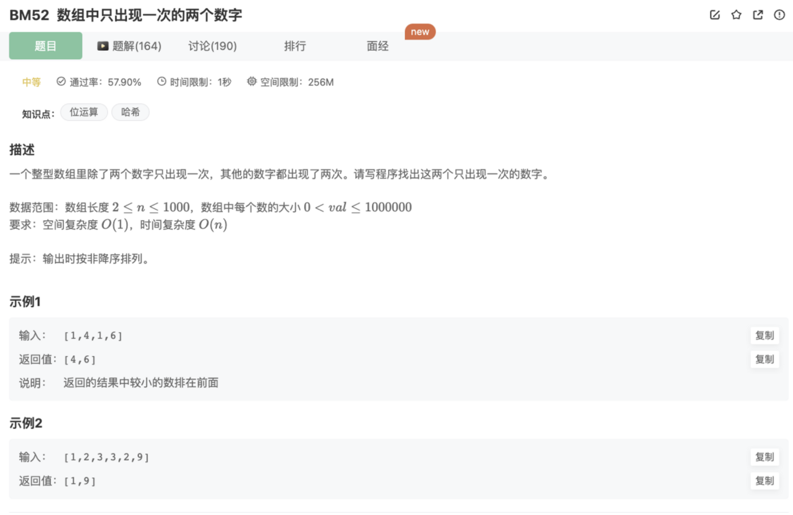

# 数组中只出现一次的两个数字

## 题目




## 代码

```jsx
/**
 * 代码中的类名、方法名、参数名已经指定，请勿修改，直接返回方法规定的值即可
 *
 * 
 * @param array int整型一维数组 
 * @return int整型一维数组
 */
function FindNumsAppearOnce( array ) {
    let hash = {}
    for(let i=0;i<array.length;i++){
        hash[array[i]] = hash[array[i]] ? hash[array[i]]+1 : 1
    }
    let res = []
    for(let i in hash){
        if(hash[i] === 1) res.push(i)
    }
    return res
}
module.exports = {
    FindNumsAppearOnce : FindNumsAppearOnce
};
```