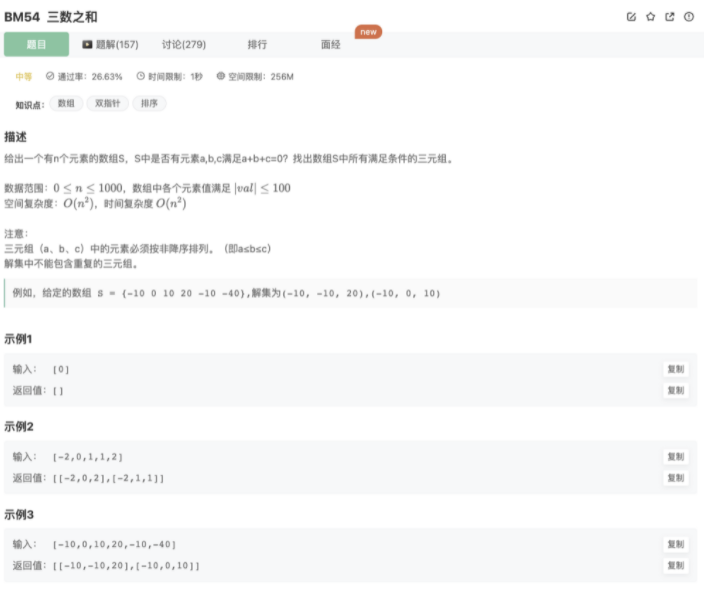

# 三数之和

## 题目




## 代码

## 思路

先对数组按从小到大排序，方便查找

三数之和等于0，我们可以从头遍历a[i]，剩下再寻找2个的和为-a[i]即可

剩下的数使用【双指针】进行查找（注意按照题目要求进行去重）

## 代码

```jsx
/**
 * 
 * @param num int整型一维数组 
 * @return int整型二维数组
 */
function threeSum( num ) {
    num.sort(function(a,b){return a-b})
    // 双指针法
    let res = []
    // 固定第一个数
    for(let i=0;i<num.length;i++){
        // // 去重 [-3,-3,1,2]
        if(i!=0 && num[i] === num[i-1]) continue 
        let left = i+1
        let right = num.length-1
        while(left < right){
            if(num[left] + num[right] === -num[i]){
                res.push([num[i],num[left],num[right]])
                while(num[left + 1] === num[left] && num[right - 1] === num[right]){    // 去重 [-3,1,1,2,2]
                    left++
                    right--
                }
                left++
                right--
            }
            if(num[left] + num[right] < -num[i]){
                left++
            }
            if(num[left] + num[right] > -num[i]){
                right--
            }
        }
    }
    return res
}
module.exports = {
    threeSum : threeSum
};
```