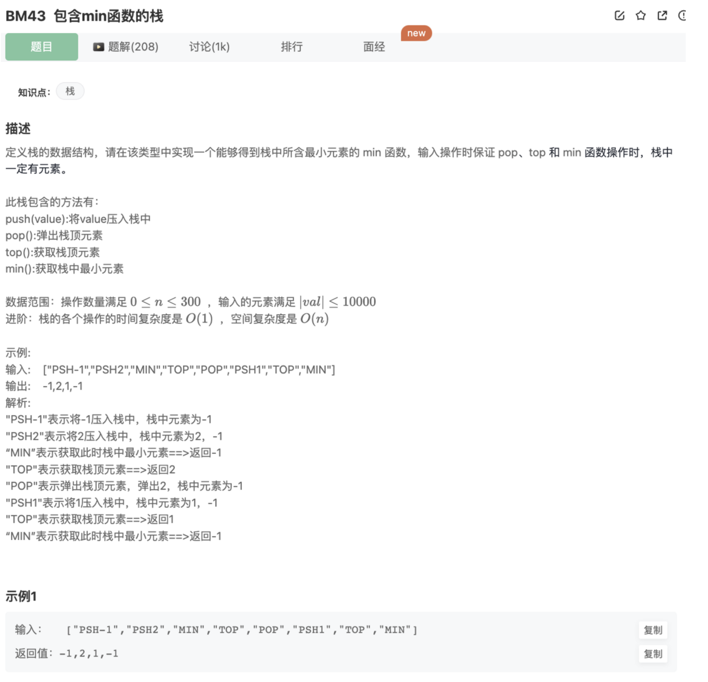

# 包含min函数的栈

## 题目




## 代码

思路：

为了在实现min函数的时候达到O(1)复杂度，意味着只能在push和pop的时候去实现这个最小值的查找

这里的思路是：构建一个最小值栈

```jsx
    if(minStack.length === 0) minStack.push(node)
    else if(node < minStack[minStack.length-1]) minStack.push(node)
    else  minStack.push(minStack[minStack.length-1])
```

然后pop的时候一起pop，保证当前栈内的最小值

```jsx
function pop()
{
    if(stack.length > 0){
        minStack.pop()
        return stack.pop()
    }
}
let stack = []
let minStack = []
function push(node)
{   
    stack.push(node)
    if(minStack.length === 0) minStack.push(node)
    else if(node < minStack[minStack.length-1]) minStack.push(node)
    else  minStack.push(minStack[minStack.length-1])
}
function pop()
{
    if(stack.length > 0){
        minStack.pop()
        return stack.pop()
    }
}
function top()
{
    if(stack.length > 0){
        return stack[stack.length-1]
    }
}
function min()
{
    if(minStack.length !== 0){
        return minStack[minStack.length-1]
    }
}
module.exports = {
    push : push,
    pop : pop,
    top : top,
    min : min
};
```