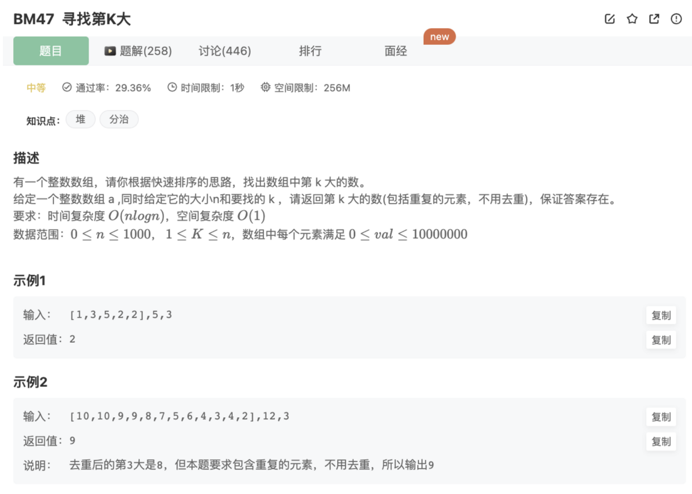

## 题目



## 思路

最大堆

这里使用最大堆进行求解

## 代码

### 最大堆求解

```jsx
/**
 * 
 * @param a int整型一维数组 
 * @param n int整型 
 * @param K int整型 
 * @return int整型
 */
function findKth( a ,  n ,  K ) {
    // JS实现最大堆
    class MaxHeap{
        constructor(){
            this.heap = []
        }
        // 交换节点的值
        swap(i1,i2){
            [this.heap[i1],this.heap[i2]] = [this.heap[i2],this.heap[i1]]
        }
        // 获取父节点
        getParentIndex(index){
            return (index - 1) >> 1 // 相等于 Math.floor((index - 1)/2)
        }
        // 获取左侧节点索引
        getLeftIndex(index){
            return (index << 1) + 1
        }
        // 获取右侧节点索引
        getRightIndex(index){
            return (index << 1) + 2
        }
        // 获得堆顶元素
        peek(){
            return this.heap[0]
        }
        // 获取堆大小
        size(){
            return this.heap.length
        }
        // 上移：把当前结点向上找到合适的位置
        shiftUp(index){
            if( index === 0) return 
            // 获取父节点
            const parentIndex = this.getParentIndex(index)
            // 如果父节点的值小于当前节点的值，则需要交换
            if(this.heap[parentIndex] < this.heap[index]){
                this.swap(parentIndex,index)
                // 然后继续上移
                this.shiftUp(parentIndex)
            }
        }
        // 下移：把当前结点向下找到合适的位置
        shiftDown(index){
            // 获取左右子节点索引
            const leftIndex = this.getLeftIndex(index);
            const rightIndex = this.getRightIndex(index);
            // 判断一下子节点的情况
            let maxChild = null
            if(this.heap[leftIndex] === undefined &&  this.heap[rightIndex] === undefined){
                return
            }else if(this.heap[leftIndex]!==undefined && this.heap[rightIndex]!==undefined){
                maxChild = this.heap[leftIndex] >= this.heap[rightIndex] ? leftIndex : rightIndex
            }else if(this.heap[leftIndex] !== undefined){
                maxChild = leftIndex
            }else if(this.heap[rightIndex] !== undefined){
                maxChild = rightIndex
            }
            if(this.heap[maxChild] > this.heap[index]){
                this.swap(maxChild,index)
                this.shiftDown(maxChild)
            }
        }
        // 删除堆顶元素：其实就是和最后一个元素交换值，移除最后一个元素，然后执行shiftDown将堆顶元素放到合适的位置
        pop(){
            this.swap(0,this.size()-1)
            let peekEle = this.heap.pop()
            this.shiftDown(0)
            return peekEle
        }
        // heap插入一个新的值
        insert(value){
            // 插入到堆的底部
            this.heap.push(value)
            // 然后上移，直到父节点<=这个值
            this.shiftUp(this.heap.length - 1)
        }
    }

    // 使用最大堆求解
    let maxHeap = new MaxHeap()
        for(let i=0;i<a.length;i++){
        maxHeap.insert(a[i])
    }
    console.log(maxHeap.heap)
    for(let i=1;i<=K;i++){
        let max = maxHeap.pop()
        console.log(max)
        if(i===K){
            return max
        }
    }
}
module.exports = {
    findKth : findKth
};
```