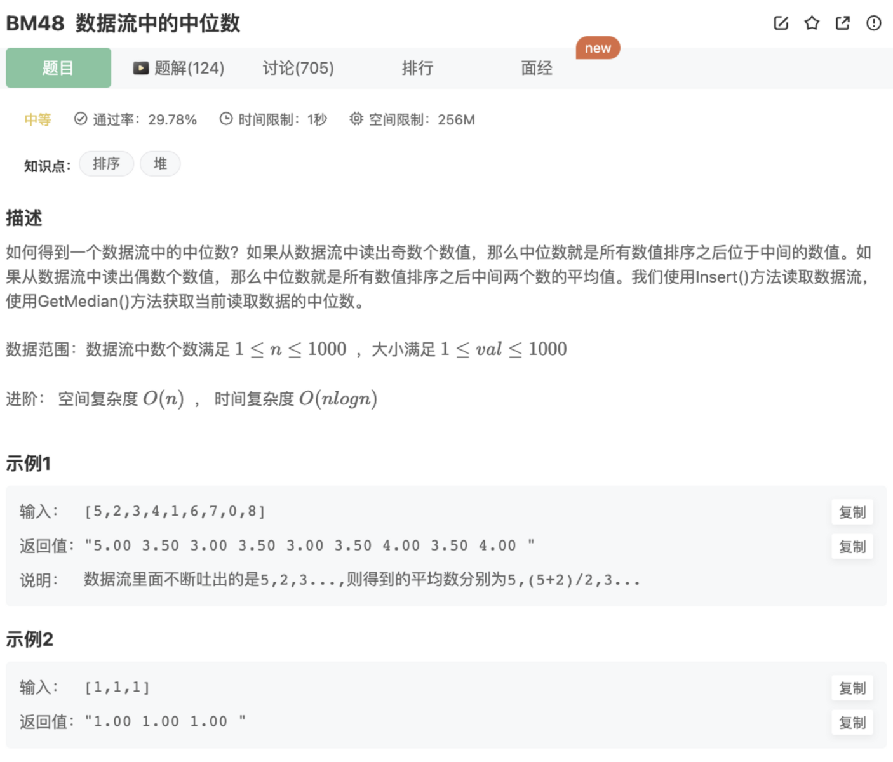

# 数据流中的中位数

## 题目




## 代码

1.暴力解法

```jsx
let arr = []
function Insert(num)
{
    arr.push(num)
}
function GetMedian(){
    arr.sort((a,b)=>{ 
        return Number(a)-Number(b)
    })
    let res = null
    // 如果是偶数
    if(arr.length%2===0){
        res = (arr[arr.length/2-1] + arr[arr.length/2])/2
    }else{ // 如果是奇数
        res = arr[Math.floor(arr.length/2)]
    }
    return res
}
module.exports = {
    Insert : Insert,
    GetMedian : GetMedian
};
```

时间复杂度：Insert()为O(1), GetMedian()为O(nlogn)

空间复杂度：O(n)


2.暴力解法的优化，使用插入排序


3.堆