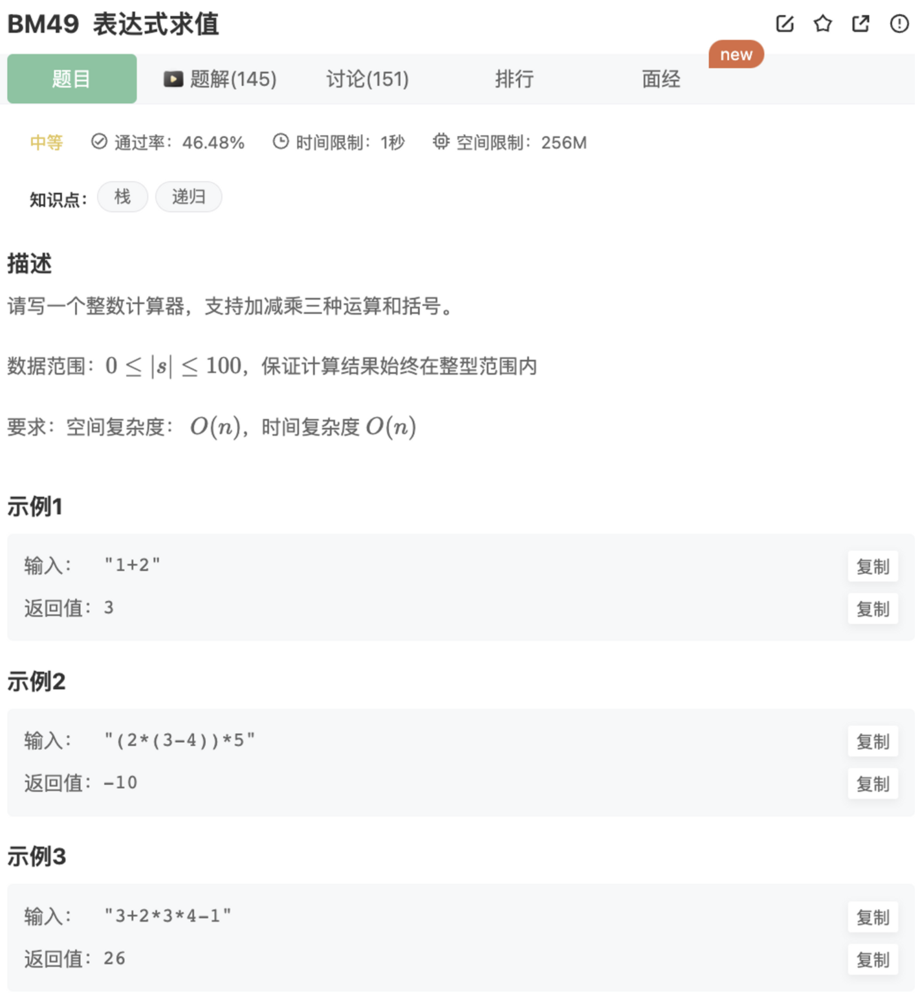

# 表达式求值

## 题目




## 代码

```jsx
/**
 * 代码中的类名、方法名、参数名已经指定，请勿修改，直接返回方法规定的值即可
 * 返回表达式的值
 * @param s string字符串 待计算的表达式
 * @return int整型
 */
function solve( s ) {
    // 计算器主函数
    const calculator = (str="") => {
        const cs = str.split("") // 所有的字符
        const nums = []
        const ops = []
        for(let i = 0;i < cs.length; i++){
            let c = cs[i]
            if(c === "("){
                // 入栈
                ops.push('(');  
            }else if(c===')'){
                while(ops.length){  // 遇到右括号，一直计算，直到遇到左括号(处理完该括号内的内容)
                    if(ops[ops.length -1] !== "("){
                        calc(nums,ops) // 计算括号内的表达式
                    }else{
                        ops.pop()
                        break;
                    }
                }
            }else {
								// 是否是数字
                if(/\\d/.test(c)){
										// 把后面是数字的拼接起来得到完整的数字
                    while(i+1<cs.length && /\\d/.test(cs[i+1])){
                        c += cs[i+1]
                        i++
                    }
                    nums.push(c)  // 把完整的数字push进nums  
                }else{  // 加减乘除
                    while(ops.length && ops[ops.length -1] !== '('){ // 如果运算符数组不为空或者最后一个是“(”符的时候，判断上一层的优先级，优先级>=的符号先处理完
                        // 根据优先级进行运算
                        const topOp = ops[ops.length - 1] // 拿到最上层的运算符
                        if(opsMap[topOp] >= opsMap[c]){
                            calc(nums,ops) // 运算符数组里面的最后一个的优先级较高则先计算
                        }else{
                            break;
                        }
                    }
                    // 上面优先级高的计算完之后
                    ops.push(c)  // 进入运算符数组 
                }
            }
        }   
        while(ops.length) calc(nums,ops);  // 统一处理

        return nums[0]  // 返回最后一个元素
    }
		// 符号的优先级
    const opsMap = {
        "+":1,
        "-":1,
        "*":2,
        "/":2
    }
	  // 计算
    const calc = (nums = [],ops = []) => {
        if(nums.length < 2 || ops.length === 0) return;
        const op = ops.pop()
        const b = ~~nums.pop()
        const a = ~~nums.pop()
        // 计算后的结果push进nums
        switch(op){
            case '+':
                nums.push(a+b) 
                break
            case '-':
                nums.push(a-b)
                break
            case "*":
                nums.push(a*b)
                break
            default:
                nums.push(a/b)       
        }
    }
    return calculator(s)
}
module.exports = {
    solve : solve
};
```