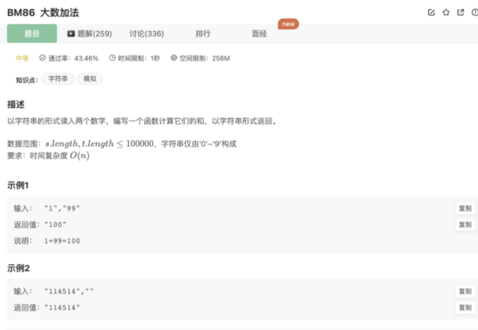

# 大数加法

## 题目




## 代码

```jsx
/**
 * 代码中的类名、方法名、参数名已经指定，请勿修改，直接返回方法规定的值即可
 * 计算两个数之和
 * @param s string字符串 表示第一个整数
 * @param t string字符串 表示第二个整数
 * @return string字符串
 */
function solve( s ,  t ) {
    if(s.length === 0) return t
    if(t.length === 0) return s
    // 设计一个进位操作，使得大数加法可行
    s = s.split('').reverse()
    t = t.split('').reverse()
    let i = 0
    let tmp = 0 // 每次计算的进位
    let res = []
    while(s[i] || t[i]){
        if(s[i]) tmp = tmp + Number(s[i])
        if(t[i]) tmp = tmp + Number(t[i])
        res.push(tmp%10)
        tmp = Math.floor(tmp/10)
        i++
    }
    if(tmp) res.push(tmp)
    return res.reverse().join('')
}
module.exports = {
    solve : solve
};
```