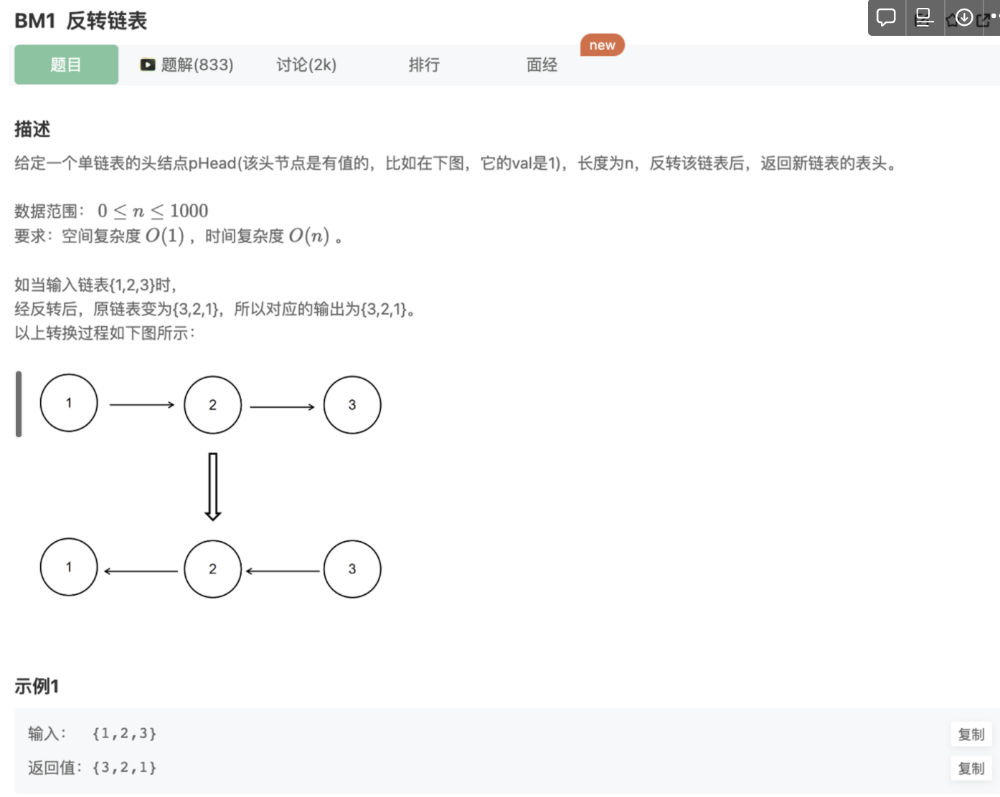

# 反转链表

## 题目




## 思路

遍历链表的每一个元素，将链表的每一个元素由**指向向后元素**改成**指向向前的元素**

## 具体过程：

- step 1：优先处理空链表，空链表不需要反转。
- step 2：我们可以设置两个指针，一个当前节点的指针，一个上一个节点的指针（初始为空）。
- step 3：遍历整个链表，每到一个节点，断开当前节点与后面节点的指针，并用临时变量记录后一个节点，然后当前节点指向上一个节点，即可以将指针逆向。
- step 4：再轮换当前指针与上一个指针，让它们进入下一个节点及下一个节点的前序节点。

```jsx
/*function ListNode(x){
    this.val = x;
    this.next = null;
}*/
function ReverseList(pHead)
{
    if(!pHead || !pHead.next) return pHead
    let provious = null, after = null;
    while(pHead) {
        after = pHead.next;    // 拿到下一个链表元素存起来
        pHead.next = provious;  // 原来向后的指针改为向前 
        provious = pHead;   // 继续处理下面2个
        pHead = after;
    } 
    // 末尾
    return provious;    // 跳出来的时候pHead==null，此时provious是最后一个链表元素
}
module.exports = {
    ReverseList : ReverseList
};
```

ES6结构赋值版本

```tsx
/*function ListNode(x){
    this.val = x;
    this.next = null;
}*/
function ReverseList(pHead)
{
    // write code here
    let prev=null
    let curr=pHead
    while(curr){
      //运用es6解构赋值，一一对应，不需要考虑赋值顺序，不需要定义额外next
        [curr.next,prev,curr]=[prev,curr,curr.next]
    }
    return prev
}
module.exports = {
    ReverseList : ReverseList
};
```