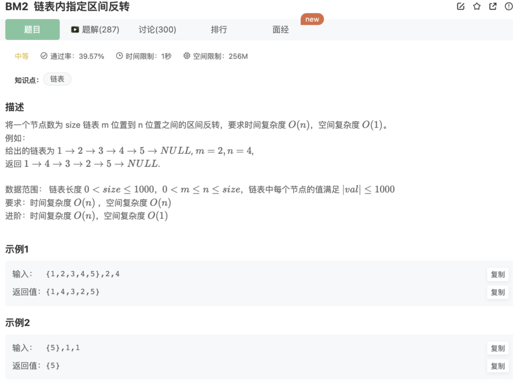
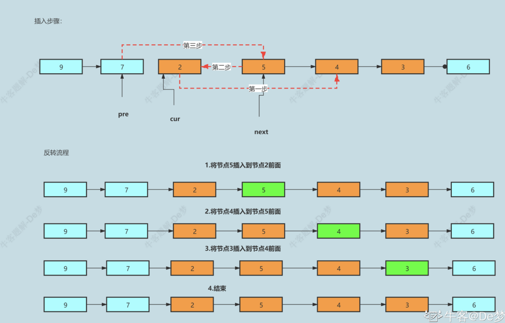

# 反转指定区间链表

## 题目



## 思路

- 要反转局部链表，可以将该局部部分当作完整链表进行反转
- 再将已经反转好的局部链表与其他节点建立连接，重构链表
- 建议使用虚拟头节点的技巧，可以避免对头节点复杂的分类考虑，简化操作

## 自己题解

```jsx
/*
 * function ListNode(x){
 *   this.val = x;
 *   this.next = null;
 * }
 */

/**
 * @param head ListNode类
 * @param m int整型
 * @param n int整型
 * @return ListNode类
 */
function reverseBetween(head, m, n) {
  // 思路：前面有链表反转的基础，这里需要找到第一个位置和最后一个位置然后进行反转，需要控制第一个的前一个和最后一个的后一个的指向
  if (!head || !head.next) return head;
  let firstItem = head,
    lastItem = null,
    preFirstItem = null,
    nextLastItem = null;
  for (var count = 1; count < m; count++) {
    // 找到反转的起始元素和其下一个元素,注意要找对元素（设置好边界条件）
    if (count === m - 1) {
      preFirstItem = firstItem;
    }
    firstItem = firstItem.next;
  }
  lastItem = firstItem;
  for (var count = m; count < n; count++) {
    // 找到反转的终止元素和其下一个元素,注意要找对元素（设置好边界条件）
    lastItem = lastItem.next;
    if (count + 1 === n ) nextLastItem = lastItem.next;
  }
  // 下面开始反转指定区间的链表
  let pre = null,
    next = null,
    cur = firstItem;
  while (pre != lastItem && m != n) {
    next = cur.next
    cur.next = pre
    pre = cur 
    cur = next
  }
  // 和反转好的链表前后对接
  if(m !== 1){  
    preFirstItem.next = lastItem
  }
  if(m != n){  
    firstItem.next = nextLastItem
  }
  // 需要考虑特殊情况，比如m=1，m=n，以及m=1同时m=n,还有n是最后一个
  if(m == 1) {
    return lastItem
  }
  return head
}
module.exports = {
  reverseBetween: reverseBetween,
};
```

## 别人优秀题解（思路一致，但是写法很优雅）

```java
import java.util.*;

/*
 * public class ListNode {
 *   int val;
 *   ListNode next = null;
 * }
 */

public class Solution {
    /**
     * 
     * @param head ListNode类 
     * @param m int整型 
     * @param n int整型 
     * @return ListNode类
     */
       // 解法一：双指针(两次遍历)
       //说明：方便理解，以下注释中将用left，right分别代替m,n节点 

    public ListNode reverseBetween (ListNode head, int m, int n) {
        //设置虚拟头节点
        ListNode dummyNode = new ListNode(-1);
        dummyNode.next = head;

        ListNode pre = dummyNode;
        //1.走left-1步到left的前一个节点
        for(int i=0;i<m-1;i++){
            pre = pre.next;
        }

        //2.走roght-left+1步到right节点
        ListNode rigthNode = pre;
        for(int i=0;i<n-m+1;i++){
            rigthNode = rigthNode.next;
        }

        //3.截取出一个子链表
        ListNode leftNode = pre.next;
        ListNode cur = rigthNode.next;

        //4.切断链接
        pre.next=null;
        rigthNode.next=null;

        //5.反转局部链表
        reverseLinkedList(leftNode);

        //6.接回原来的链表
        pre.next = rigthNode;
        leftNode.next = cur;
        return dummyNode.next;
    }
    //反转局部链表
    private void reverseLinkedList(ListNode head){
        ListNode pre = null;
        ListNode cur = head;
        while(cur!=null){
            //Cur_next 指向cur节点的下一个节点
            ListNode Cur_next = cur.next;
            cur.next = pre;
            pre = cur;
            cur = Cur_next ;
        }
    }
}
```

## 时间复杂度和空间复杂度

时间复杂度：O(N) 其中 N是链表总节点数。最坏情况下，需要遍历整个链表

空间复杂度：O(1) **仅使用到常数个变量**

## 自己和别人题解对比分析

思路答题相同，但是别人的题解较为简洁，原因： 1.使用虚拟头节点的技巧，可以避免对头节点复杂的分类考虑，简化操作 2.他将需要反转的链表前后切段，然后封装一个【反转局部链表】函数去处理 3.问题分析得不够透彻，需要依靠测试用例来完善代码，考虑完所有情况，且对应的处理代码显得比较冗余和难理解

## 其他解法

类似第一步一样，一步一步把结点给改过来



```java
import java.util.*;

/*
 * public class ListNode {
 *   int val;
 *   ListNode next = null;
 * }
 */

public class Solution {
    /**
     * 
     * @param head ListNode类 
     * @param m int整型 
     * @param n int整型 
     * @return ListNode类
     */
       // 
       //说明：方便理解，以下注释中将用left，right分别代替m,n节点 

    public ListNode reverseBetween (ListNode head, int m, int n) {
             //设置虚拟头节点
        ListNode dummyNode = new ListNode(-1);
        dummyNode.next =head;
        ListNode pre = dummyNode;
        for(int i=0;i<m-1;i++){
            pre = pre.next;
        }

        ListNode cur = pre.next;
        ListNode Cur_next ;
        for(int i=0;i<n-m;i++){
            Cur_next = cur.next;
            cur.next = Cur_next.next;
            Cur_next .next = pre.next;
            pre.next = Cur_next ;
        }
        return dummyNode.next;
    }
}
```

## 递归解法（看不懂）

思路： 我们来看看另一种分析：如果`m == 1`，就相当于反转链表的前n元素；如果 `m != 1`，我们把 head 的索引视为 1，那么我们是想从第 m个元素开始反转，如果把 head.next 的索引视为1，那相对于 head.next的反转的区间应该是从第 m−1 个元素开始的，以此类推，反转区间的起点往后就是一个子问题，我们可以使用递归处理：

- **终止条件：** 当`m == 1`，就可以直接反转前n个元素。
- **返回值：** 将已经反转后的子问题头节点返回给上一级。
- **本级任务：** 递归地缩短区间，拼接本级节点与子问题已经反转的部分。

```java
//从头开始往后去掉前面不反转的部分
ListNode node = reverseBetween(head.next, m - 1, n - 1)
```

而每次反转，如果`n == 1`，相当于只颠倒第一个节点，如果不是，则进入后续节点（子问题），因此反转过程也可以使用递归：

- **终止条件：** 当`n == 1`时，只反转当前头节点即可。
- **返回值：** 将子问题反转后的节点头返回。
- **本级任务：** 缩短*n*进入子问题反转，等子问题回到本级再反转当前节点与后续节点的连接。

```java
//颠倒后续的节点，直到n=1为最后一个
ListNode node = reverse(head.next, n - 1)
```

步骤：

1.准备全局变量temp，最初等于null，找到递归到第n个节点时，指向其后一个位置，将要反转部分的起点（即反转后的尾）连接到这个指针

2.按照第一个递归的思路缩短子问题找到反转区间的起点，将反转后的部分拼接到前面正常的后面

3.按照第二个递归的思路缩短终点的子问题，从第n个位置开始反转，反转过程中每个问题作为反转后的尾，都要指向temp

```java
import java.util.*;
public class Solution {
    ListNode temp = null;
    public ListNode reverse(ListNode head, int n){
        //只颠倒第一个节点，后续不管
        if(n == 1){ 
            temp = head.next;
            return head;
        }
        //进入子问题：颠倒后续的节点，直到n=1为最后一个
        ListNode node = reverse(head.next, n - 1); 
        //反转
        head.next.next = head;
        //每个子问题反转后的尾拼接第n个位置后的节点
        head.next = temp; 
        return node;
    }
    public ListNode reverseBetween (ListNode head, int m, int n) {
        //从第一个节点开始
        if(m == 1)   // 递归的终止条件
            return reverse(head, n);
        //缩减子问题：从头开始往后去掉前面不反转的部分
        ListNode node = reverseBetween(head.next, m - 1, n - 1); 
        //拼接已翻转
        head.next = node;
        return head;
    }
}
```

其他： 线性表，链表 链表找到某一个元素必须从头到尾去遍历