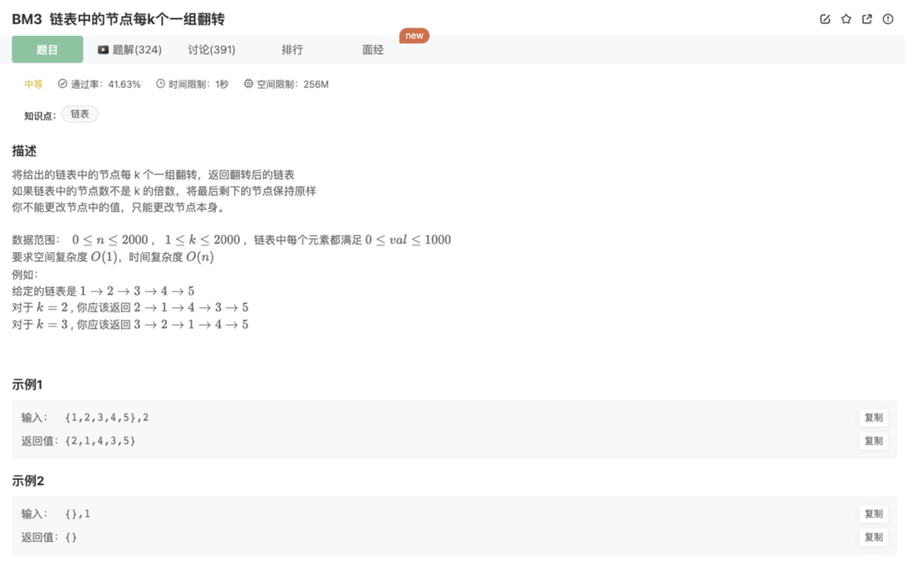
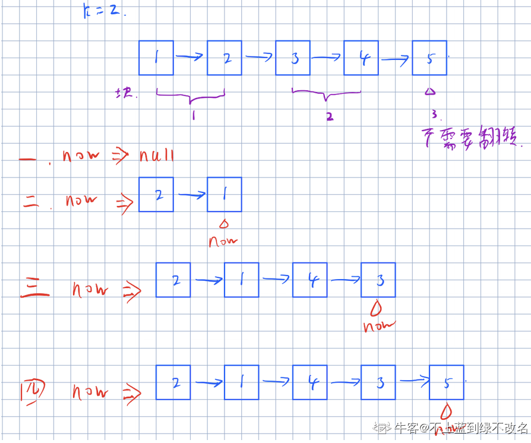
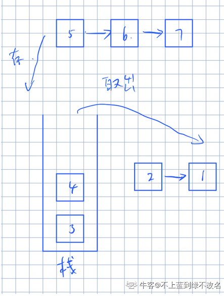

# 链表中的节点每k个一组翻转

## 题目



## 自己题解

```tsx
/*
 * function ListNode(x){
 *   this.val = x;
 *   this.next = null;
 * }
 */

/**
  * @param head ListNode类 
  * @param k int整型 
  * @return ListNode类
  */
function reverseKGroup( head ,  k ) {
    if(!head || !head.next) return head
    // 每k个一组加入新数组
    let cur = head
    let count = 0
    let listArr = []
    let temArr = []
    while(cur){
        temArr.push(cur)
        cur = cur.next
        count++
        if(count === k){
            listArr.push(temArr)
            temArr = []
            count = 0
        }
    }
    // 新数组里面每组进行翻转,并进行组内重新链接
    for(let i=0;i<listArr.length;i++){
        listArr[i].reverse()
        for(let j=0;j<listArr[i].length-1;j++){
            listArr[i][j].next = listArr[i][j+1]
        }
    }
    if(temArr.length != 0) listArr.push(temArr)  // 最后一组无需经过上面的翻转处理
    // 组与组间重新链接
    for(let i=0;i<listArr.length-1;i++){
        let length = listArr[i].length
        listArr[i][length-1].next = listArr[i+1][0]
    }
    listArr[listArr.length-1].slice(-1)[0].next = null
    
    return listArr[0][0]
}
module.exports = {
    reverseKGroup : reverseKGroup
};
```

官方的题解

```java
import java.util.*;
public class Solution {
    public ListNode reverseKGroup (ListNode head, int k) {
        //找到每次翻转的尾部
        ListNode tail = head;
        //遍历k次到尾部 
        for(int i = 0; i < k; i++){ 
            //如果不足k到了链表尾，直接返回，不翻转
            if(tail == null) 
                return head;
            tail = tail.next; 
        }
        //翻转时需要的前序和当前节点
        ListNode pre = null; 
        ListNode cur = head;
        //在到达当前段尾节点前
        while(cur != tail){ 
            //翻转
            ListNode temp = cur.next; 
            cur.next = pre;
            pre = cur;
            cur = temp;
        }
        //当前尾指向下一段要翻转的链表
        head.next = reverseKGroup(tail, k); 
        return pre;
    }
}
```

递归去分块处理，递归终点是

```java
if(tail == null) 
   return head;
```

## 别人的优秀题解

方法一 模拟

将一条链表分块分为链表长度/k块链表，如果处不尽则说明后面会有剩下的那一块是不满长度为k的。在最初的时候需要定义两个NodeList表示result(结果)和 now(当前所到达的结果链表的位置)。之后遍历块的长度，对每一个链表块进行翻转，再翻转完后将完成的链表插入到now链表的下一个，再将now链表更新到最前即可。



```java
public class Solution {
    /**
     * @param head ListNode类 
     * @param k int整型 
     * @return ListNode类
     */
    public ListNode reverseKGroup (ListNode head, int k) {
        // 边界处理
        if(k <= 1) return head;
        if(head == null) return head;

        ListNode node = head; // 临时存储，为了下面利用计算出长度后能恢复
        int len = length(head); // 获取长度函数单独封装
        head = node; // 恢复
        int sx = len / k;    //分成sx块向下取整（默认向下） 因为处不尽的后面必然凑不满k个
        ListNode result = new ListNode(0); // 结果
        ListNode now = result; // 指示新拼接出的链表的最后位置
				
        for(int i = 0; i < sx; i ++){ // 进行sx次
            ListNode pre = null;
            for(int j = 0; j < k; j ++){    //将第i块的元素翻转
                ListNode next = head.next;
                head.next = pre;
                pre = head;
                head = next;
            } 
            now.next = pre; // 每一轮的块出来，pre是当前块的最后一个元素
            while(now.next != null) now = now.next;    //将now更新到最前的一个点
        }
        now.next = head; // 遍历完之后，此时的head是最后不满k个的那一段
        return result.next;
    }
    public int length(ListNode now){    //获取链表长度
        int cnt = 0;
        if(now != null) cnt = 1;
        while(now.next != null){
            cnt ++; now = now.next;
        }
        return cnt;
    }
}
```

方法二 栈

和方法一一样将链表分成每段长度为k的子链表，将每个链表存入栈中，当栈中有k个元素即可一一取出，之后按取出的顺序重组链表就是这一段中翻转的链表，要注意的是处理尾部不满长度为k的链表块时直接取栈底的元素做为最后一段即可。



```java
public ListNode reverseKGroup (ListNode head, int k) {
				// 边界处理
        if(k <= 1 || head == null) return head;

        Deque<ListNode> st = new ArrayDeque<ListNode>();    //模拟栈

        ListNode result = new ListNode(0);
        ListNode now = result;

        int cnt = 0;
        while(true){
            for(int i = 0; i < k; i ++){    //将当前链表前k个存入栈中
                st.push(head);
                head = head.next;
                cnt ++;
                if(head == null) break;
            }
            if(cnt == k){    //如果当前栈中有k个元素则一一取出存入链表
                while(!st.isEmpty()){
                    now.next = st.pop();
                    now = now.next; now.next = null;
                }
            }
            if(head == null) break;   //如果链表取完了跳出循环
            cnt = 0;
        }
        ListNode end = null;
        while(!st.isEmpty()){    //如果栈中还有剩下的就说明是最后的一块直接取栈底即可
            end = st.pop();
        }
        now.next = end;
        return result.next;
    }
```

总结：

都是分块之后进行链表翻转处理

```java
ListNode result = new ListNode(0); // 结果
ListNode now = result; // 指示新拼接出的链表的最后位置
```

使用了result指针表示最后的结果

now指针去连接各个分块

不同：

方法一是for循环去分块再翻转（常规）

方法二是利用了栈去做翻转，k个进栈，然后出栈并连接，完成一次分块