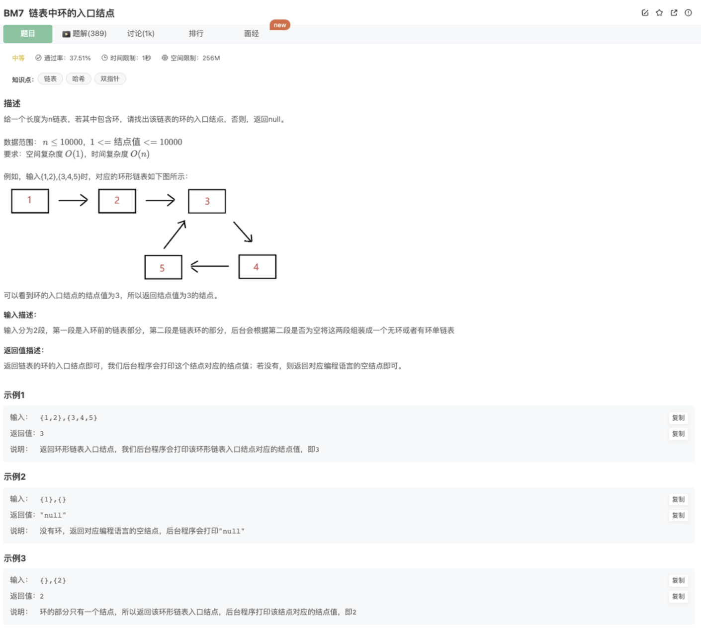
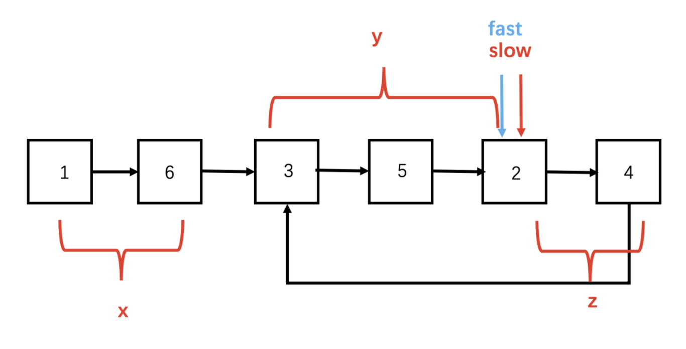

# 链表中环的入口结点

# 题目



## 代码

hash

```jsx
function EntryNodeOfLoop(pHead)
{
    if(!pHead || !pHead.next) return
    // 使用hash
    const hash = new Map()
    while(pHead){
        if(hash.get(pHead)) return pHead
        hash.set(pHead,true)
        pHead = pHead.next 
    }
    return 
}
```

## 官方题解

### 快慢指针

难点在于要使用快慢指针求解，就必须模拟快慢指针的过程，得出一些结论



主要思路：

那我们现在假定已经是一个有环的链表了，那么这个链表中怎么找到环的入口呢？在慢指针进入链表环之前，快指针已经进入了环，且在里面循环，这才能在慢指针进入环之后，快指针追到了慢指针，不妨假设快指针在环中走了n圈，慢指针在环中走了m圈，它们才相遇，而进入环之前的距离为x，环入口到相遇点的距离为y，相遇点到环入口的距离为z。快指针一共走了x+n(y+z)+y步，慢指针一共走了x+m(y+z)+y，这个时候快指针走的倍数是慢指针的两倍，则x+n(y+z)+y=2(x+m(y+z)+y)，这时候x+y=(n−2m)(y+z)，因为环的大小是y+z，说明从链表头经过环入口到达相遇地方经过的距离等于整数倍环的大小：那我们从头开始遍历到相遇位置，和从相遇位置开始在环中遍历，会使用相同的步数，而双方最后都会经过入口到相遇位置这y个节点，那说明这y个节点它们就是重叠遍历的，那它们从入口位置就相遇了，这我们不就找到了吗？

具体做法：

- step 1：使用[BM6.判断链表中是否有环](https://www.nowcoder.com/practice/650474f313294468a4ded3ce0f7898b9?tpId=295&sfm=html&channel=nowcoder)中的方法判断链表是否有环，并找到相遇的节点
- step 2：慢指针继续在相遇节点，快指针回到链表头，两个指针同步逐个元素逐个元素开始遍历链表
- step 3：再次相遇的地方就是环的入口

```jsx
/*function ListNode(x){
    this.val = x;
    this.next = null;
}*/
function EntryNodeOfLoop(pHead)
{
    // 使用快慢指针求解
    let fast = pHead
    let slow = pHead
    // 1.找出相遇节点
    let encounterNode = null
    while(fast){
        if(!fast.next || !fast.next.next) return 
        slow = slow.next
        fast = fast.next.next
        if(slow === fast) {
            encounterNode = slow
            break;
        }
    }
    // 2.重新调整指针，一个在原本头节点位置开始遍历，一个在相遇位置开始遍历，找出他们再次相遇的节点
    let point1 = pHead
    let point2 = encounterNode
    while(point1 !== point2){
        point1 = point1.next
        point2 = point2.next
    }
    return point2
    // console.log(encounterNode)
}
module.exports = {
    EntryNodeOfLoop : EntryNodeOfLoop
};
```