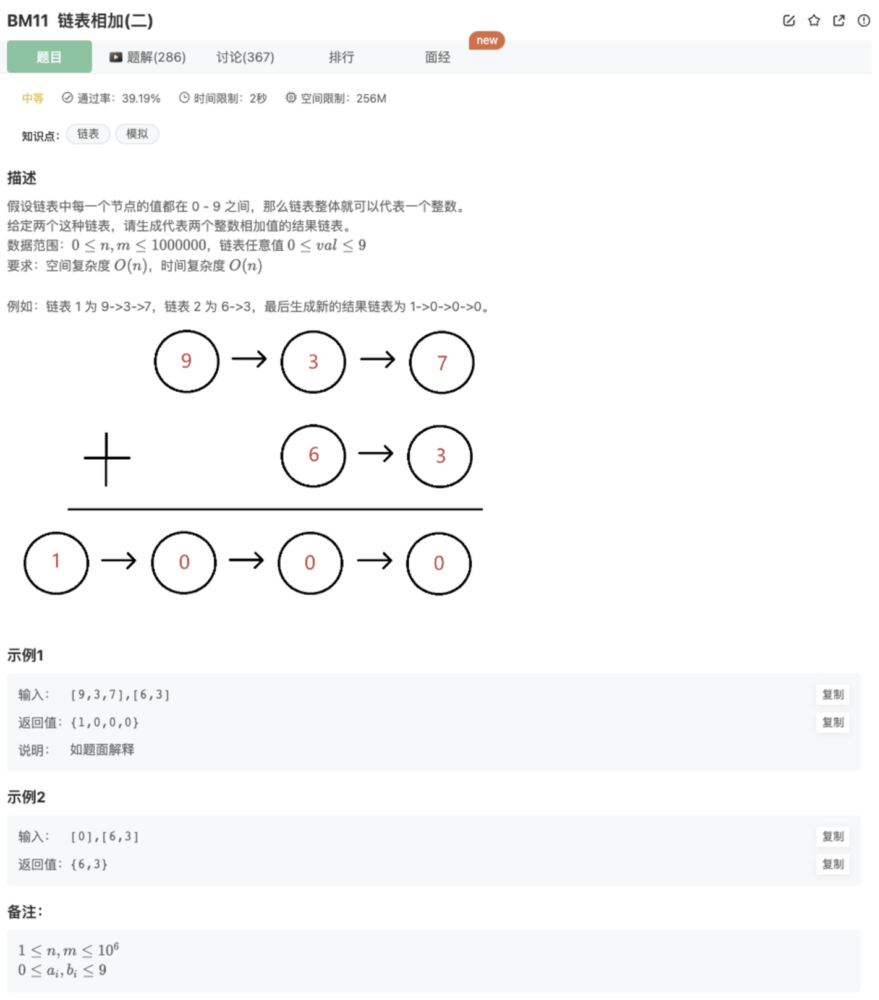

# 链表相加（二）

## 题目



## 代码

1.翻转链表 + 进位处理

```jsx
function addInList( head1 ,  head2 ) {
    // 异常值处理
    if(!head1){
        return head2
    } 
    if(!head2){
        return head1
    }
    // 利用翻转链表处理
    head1 = reverseList(head1)
    head2 = reverseList(head2)
    let pointer = new ListNode(-1)
    let res = pointer
    let tmp = 0 // 每次计算的进位
    while(head1 && head2) {handelCalc()}
    // 处理剩余
    while(head1) {handelCalc()}
    while(head2) {handelCalc()}

    if(tmp) pointer.next = new ListNode(tmp)

    return reverseList(res.next)

    // 处理计算和进位
    function handelCalc(){
        if(head1){
            tmp = tmp + head1.val 
            head1 = head1.next
        }
        if(head2){
            tmp = tmp + head2.val
            head2 = head2.next
        }
        pointer.next = new ListNode(tmp%10) 
        pointer = pointer.next
        tmp = Math.floor(tmp/10)
    }

    function reverseList(head){
        if(!head) return head
        let cur = head
        let pre = null
        while(cur){
            let next = cur.next
            cur.next = pre
            pre = cur
            cur = next
        }
        return pre
    }
    
}
```

2.辅助栈翻转+进位处理

```jsx
function addInList( head1 ,  head2 ) {
    // 异常值处理
    if(!head1){
        return head2
    } 
    if(!head2){
        return head1
    }
    // 利用栈翻转+进位计算处理
    let stack1 = []
    let stack2 = []
    while(head1){
        stack1.push(head1)
        head1 = head1.next
    }
    while(head2){
        stack2.push(head2)
        head2 = head2.next
    }
    let preNode = null
    let node1,node2
    let tmp = 0
		// 下面的3段代码实际上可以像上面那样抽取出来，但是这里想去打游戏懒得去做了，你可以试一下
    while(stack1.length > 0 && stack2.length > 0){
        node1 = stack1.pop()
        node2 = stack2.pop()
        tmp = tmp + node1.val + node2.val
        let node = new ListNode(tmp%10)
        node.next = preNode
        preNode = node
        tmp = Math.floor(tmp/10)
    }
    while(stack1.length > 0){
        node1 = stack1.pop()
        tmp = tmp + node1.val
        let node = new ListNode(tmp%10)
        node.next = preNode
        preNode = node
        tmp = Math.floor(tmp/10)
    }
    while(stack2.length > 0){
        node2 = stack2.pop()
        tmp = tmp + node2.val
        let node = new ListNode(tmp%10)
        node.next = preNode
        preNode = node
        tmp = Math.floor(tmp/10)
    }
    if(tmp) {
        let node = new ListNode(tmp)
        node.next = preNode
        preNode = node
    }

    return preNode
    
}
```