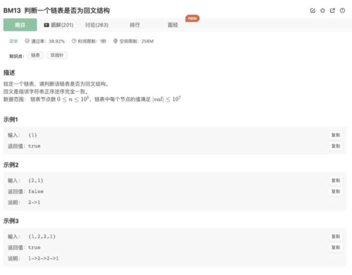

# 判断一个链表是否为回文结构

## 题目



## 代码

思路：

1. 使用快慢指针找中点(还有一种方法是遍历一遍链表找到length，再Math.ceil(lnegth/2),遍历也能找到中点)
2. 找到中点后，将右侧的链表翻转
3. 左右两侧链表一起从头开始遍历，并比较当前遍历项的val是否相等

```jsx
/*
 * function ListNode(x){
 *   this.val = x;
 *   this.next = null;
 * }
 */

/**
 * 
 * @param head ListNode类 the head
 * @return bool布尔型
 */
function isPail( head ) {
    // 处理特殊值
    if(!head) return false
    if(!head.next) return true
    // 使用快慢指针找中点(还有一种方法是遍历一遍链表找到length，再Math.ceil(lnegth/2),遍历也能找到中点)
    let slow = head
    let fast = head.next
    while(fast && fast.next){
        slow = slow.next
        fast = fast.next.next
    }
    // 找到中点后，将右侧的链表翻转
    let cur = slow.next
    let pre = null
    while(cur){
        let next = cur.next
        cur.next = pre
        pre = cur
        cur = next
    }
    // pre则是右侧链表翻转后的头结点
    console.log(pre)
    console.log(slow)
    let right = pre
    while(right){
        if(right.val != head.val) return false
        right = right.next
        head = head.next
    }
    return true
}
module.exports = {
    isPail : isPail
};
```

## 其他思路

使用辅助数组

1.2个辅助数组

- step 1：遍历一次链表，将元素取出放入辅助数组中。
- step 2：准备另一个辅助数组，录入第一个数组的全部元素，再将其反转。
- step 3：依次遍历原数组与反转后的数组，若是元素都相等则是回文结构，只要遇到一个不同的就不是回文结构

2.1个辅助数组，利用前后指针（下表一起移动）

- step 1：遍历一次链表，将元素取出放入辅助数组中。
- step 2：使用下标访问，两个下标代表两个指针，两个指针分别从数组首尾开始遍历，左指针指向开头，从左到右，右指针指向数组末尾，从右到左，依次比较元素是否相同。
- step 3：如果有不一样，则不是回文结构。否则遍历到两个指针相遇就好了，因为左指针到了右半部分都是右指针走过的路，比较的值也是与之前相同的。

附上判断数组是否回文代码

```jsx
// 判断数组是否回文版本
    function isPail_Arr(arr){
        for(let i=0;i<Math.ceil(arr.length/2);i++){ 
            if(arr[i] != arr[arr.length - i - 1]){
                return false
            }
        }
        return true
    }
```