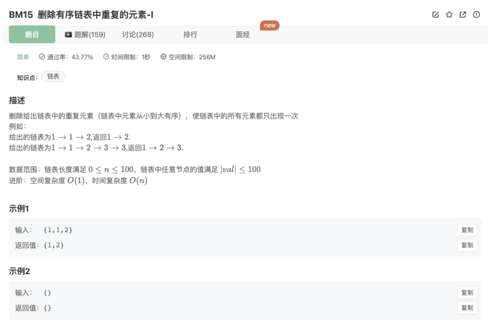

# 删除有序链表中重复的元素-I

## 题目



## 代码

```jsx
/*
 * function ListNode(x){
 *   this.val = x;
 *   this.next = null;
 * }
 */

/**
  * @param head ListNode类 
  * @return ListNode类
  */
function deleteDuplicates( head ) {
    // 处理异常
    if(!head || !head.next) return head
    // 使用双指针处理问题
    let behind = head
    let front = behind.next
    while(front){
      // 判断是否相等，相等则一直去掉
      while(front && (front.val === behind.val)){
        behind.next = front.next
        front = front.next
      }
      // 不相等等时候则2者一起往前移动
      if(front != null){
        front = front.next
        behind = behind.next
      }
    }
    return head
}
module.exports = {
    deleteDuplicates : deleteDuplicates
};
```

## 优化

事实上，思路一样，代码可以更加简单

使用一个指针即可，判断当前指针指向结点和他的next是否相等

```jsx
/*
 * function ListNode(x){
 *   this.val = x;
 *   this.next = null;
 * }
 */

/**
  * @param head ListNode类 
  * @return ListNode类
  */
function deleteDuplicates( head ) {
    // 处理异常
    if(!head || !head.next) return head
    let cur = head
    while(cur.next!=null){ // 如果有下一个结点，反复进行下面的过程
      if(cur.val === cur.next.val){   // 如果相等，删除next结点（修改cur.next指向即可）
        cur.next = cur.next.next
      }else{
        cur = cur.next // 不相等，移动到下一个位置
      }
    }
    return head
}
module.exports = {
    deleteDuplicates : deleteDuplicates
};
```