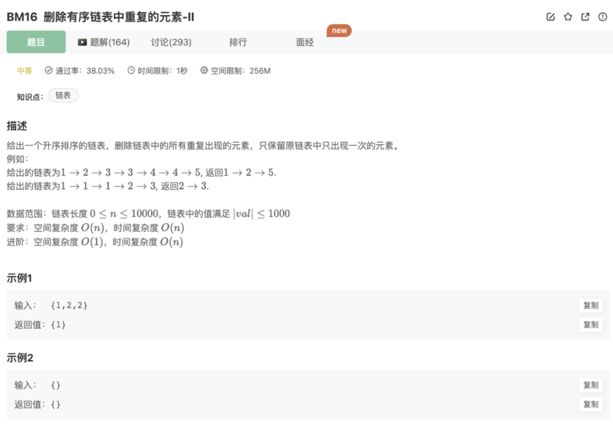

# 删除有序链表中重复的元素-II

## 题目



## 思路

哈希表

哈希表是一种根据key访问value的一种数据结构

哈希表常用于统计频率，快速检验某个元素是否出现过等

## 代码

hash表

```jsx
/*
 * function ListNode(x){
 *   this.val = x;
 *   this.next = null;
 * }
 */

/**
  * 
  * @param head ListNode类 
  * @return ListNode类
  */
function deleteDuplicates( head ) {
    if(!head || !head.next) return head
    // 使用hash
    let hash = new Map()
    let cur = head
    while(cur){
      hash.get(cur.val) === undefined ? hash.set(cur.val,1) : hash.set(cur.val,hash.get(cur.val)+1)
      cur = cur.next
    }
    let res = new ListNode(-1)
    res.next = null
    let pointer = res
    let pre = head
    console.log(head)
    cur = head
    while(cur){
      console.log(hash.get(cur.val))
      if(hash.get(cur.val)===1){
        pointer.next = cur
        pointer = pointer.next
      }
      pre = cur
      cur = cur.next
      pre.next = null
    }
    return res.next
}
module.exports = {
    deleteDuplicates : deleteDuplicates
};
```

## 其他思路

参考BM15，在其基础上拓展

- step 1：给链表前加上表头，方便可能的话删除第一个节点
- step 2：遍历链表，每次比较相邻两个节点，如果遇到了两个相邻节点相同，则新开内循环将这一段所有的相同都遍历过去
- step 3：在step 2中这一连串相同的节点前的节点直接连上后续第一个不相同值的节点。
- step 4：返回时去掉添加的表头


```java
import java.util.*;
public class Solution {
    public ListNode deleteDuplicates (ListNode head) {
        //空链表
        if(head == null) 
            return null;
        ListNode res = new ListNode(0);
        //在链表前加一个表头
        res.next = head; 
        ListNode cur = res;
        while(cur.next != null && cur.next.next != null){ 
            //遇到相邻两个节点值相同
            if(cur.next.val == cur.next.next.val){ 
                int temp = cur.next.val;
                //将所有相同的都跳过
                while (cur.next != null && cur.next.val == temp) 
                    cur.next = cur.next.next;
            }
            else 
                cur = cur.next;
        }
        //返回时去掉表头
        return res.next; 
    }
}
```