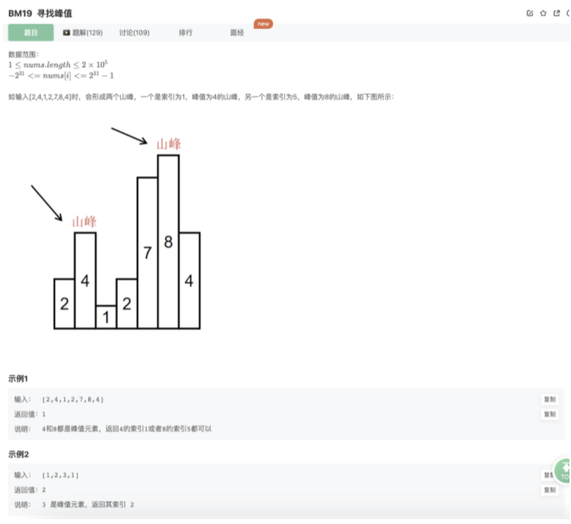

# 寻找峰值

## 题目



## 思路

上坡一定有坡峰，下坡不一定有坡峰

按照题意，虽然可能会有多个波峰，但是实际上，我们只需要找到其中一个即可，那么实际上，我们可以把他当做只有一个波峰然后按照二分法去做

## 代码

```jsx
/**
 * 代码中的类名、方法名、参数名已经指定，请勿修改，直接返回方法规定的值即可
 *
 * 
 * @param nums int整型一维数组 
 * @return int整型
 */
function findPeakElement( nums ) {
    // 只需要找到一个波峰既可，这里把整体看作只有一个波峰去找，二分法不断缩小，找到其中一个即可
    let left = 0
    let right = nums.length-1
    while(left!==right){
        let mid = Math.floor((left+right)/2)
        if(nums[mid]>nums[mid+1]){
            right = mid
        }
        if(nums[mid]<nums[mid+1]){
            left = mid+1
        }
    } 
    return left
}
module.exports = {
    findPeakElement : findPeakElement
};
```