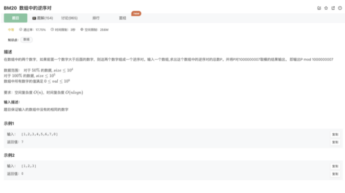

# 数组中的逆序对

## 题目



## 思路

### 1.暴力遍历

nothing to say

### 2.归并排序的思想

利用了归并排序的过程

合并的时候，会进行2个数组每个元素比较加入新数组的过程

在这个过程中，如果left数组的当前元素大于right数组的当前元素，`count += leftArr.length` 意味着这一轮比较，left数组目前所有元素都大于right数组当前元素，在`right.pop()`之前，统计这些逆序对

## 代码

```jsx
function InversePairs(arr)
{
    let count = 0
    merge_sort(arr)
    // 利用归并排序的过程求解
    function merge_sort(arr){
        // console.log(arr)
        if(arr.length === 1) return arr
        let mid = Math.ceil((arr.length-1)/2)
        let leftArr = merge_sort(arr.slice(0,mid))
        let rightArr = merge_sort(arr.slice(mid))
        let newArr = []
        // 左右有序数组合并
        while(leftArr.length && rightArr.length){
            if(leftArr[0] > rightArr[0]){
                count += leftArr.length // 在这里增加对逆序对的统计
                newArr.push(rightArr.shift())
            }else if(leftArr[0] <= rightArr[0]){
                newArr.push(leftArr.shift())
            }

        }
        newArr = leftArr.length ? newArr.concat(leftArr) : newArr.concat(rightArr)
        return newArr
    }
    return count%1000000007
}
module.exports = {
    InversePairs : InversePairs
};
```