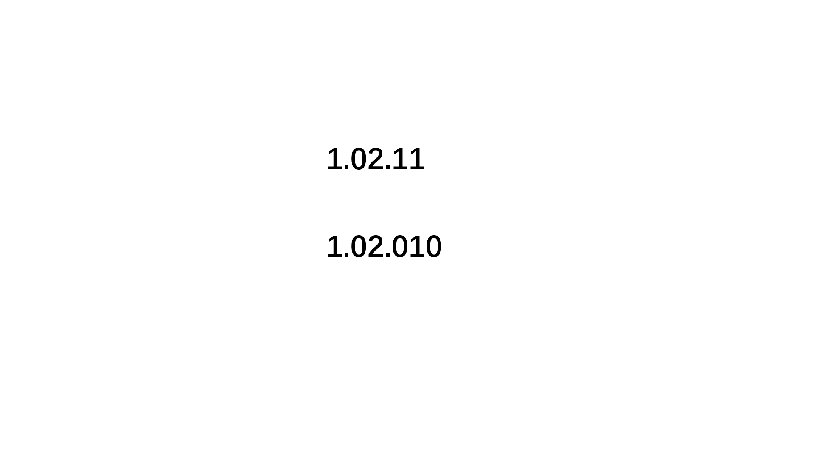

# 比较版本号

## 题目


## 代码

```jsx
/**
 * 代码中的类名、方法名、参数名已经指定，请勿修改，直接返回方法规定的值即可
 *
 * 比较版本号
 * @param version1 string字符串 
 * @param version2 string字符串 
 * @return int整型
 */
function compare( version1 ,  version2 ) {
		// 以“.”间隔，拿到数字字符数组
    let version1Arr = version1.split('.').map((item)=>{
        return Number(item)
    })
    let version2Arr = version2.split('.').map((item)=>{
        return Number(item)
    })
		
		// 逐个比较
    while(version1Arr.length && version2Arr.length){
        let num1 = version1Arr.shift()
        let num2 = version2Arr.shift()
        if(num1 > num2){
            return 1
        }
        if(num1 < num2){
            return -1
        }
    }
		// version1Arr剩余，并且version1Arr剩余的元素有不是0的数
    if(version1Arr.length && version1Arr.some((item)=>{return item!=0})){
        return 1
    }
		// version2Arr剩余，并且version2Arr剩余的元素有不是0的数
    if(version2Arr.length && version2Arr.some((item)=>{return item!=0})){
        return -1
    }
    return 0

}
module.exports = {
    compare : compare
};
```


## 其他解法

双指针遍历处理

