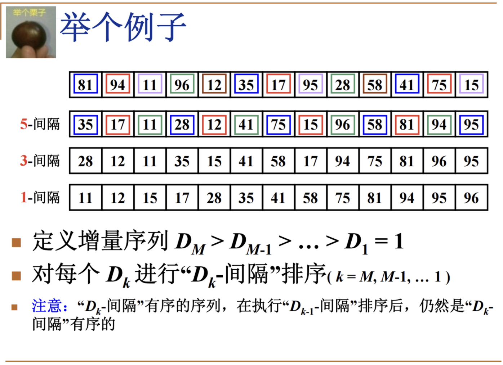

# 希尔

插入排序的效率优化

又称缩小增量排序

改进的理由：排序的过程其实就是消除逆序对的过程，相比于插入排序每次拿相邻元素去插入，使用更大的间隔每次将能消除更大的逆序对

下面是经过了5、3、1之后的结果，到1的时候基本有序（插入排序在基本有序的时候比较高效）



具体实现：

```jsx
function Shell_Sort(arr){
	for(let D=Math.floor(arr.length/2);D>0;D=Math.floor(D/2)){
			for(let i=D;i<arr.length;i++){
				for(let j=i;j>0;j-=D){
					let temp = arr[j]
					if(arr[j] < arr[j-D]){ 
						arr[j] = arr[j-D]
						arr[j-D] = temp
					}else{
						break
					}
				}
			}
	}
	return arr 
}
```