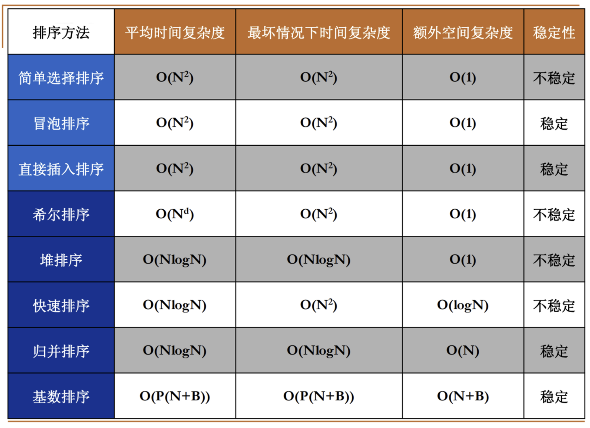

# 总结

简单排序：

时间复杂度较大，但是程序比较简单好写

希尔排序：

平均时间复杂度取决于增量序列的选择，最坏情况下d=2

堆排序、归并排序：

理论上是效率最好的，归并排序需要额外的空间复杂度N（意味着和其他排序算法相比，他最多只能处理他们一半的元素）

快速排序：

理论上效率也不错，因为他利用了递归去解决，所以需要额外的空间复杂度O(N)

基数排序：

某种情况下比O(NlogN)还要快（取决于N、B、P的值）

关于稳定：

相邻元素交换的都是稳定的，跳着交换的是不稳定的