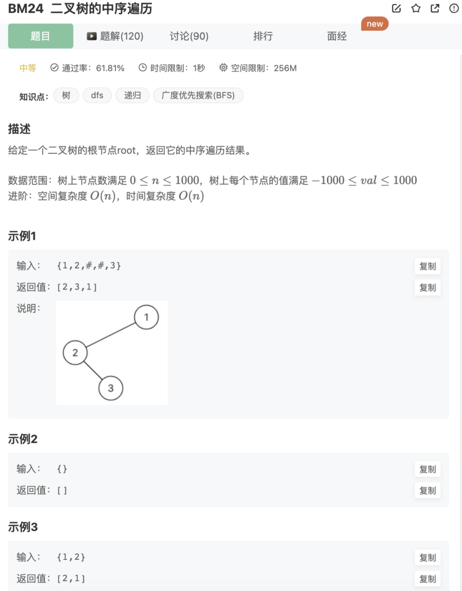

# 二叉树的中序遍历

## 题目



## 代码

递归

```jsx
/**
 * 代码中的类名、方法名、参数名已经指定，请勿修改，直接返回方法规定的值即可
 *
 * 
 * @param root TreeNode类 
 * @return int整型一维数组
 */
function inorderTraversal( root ) {
    if(!root) return []
    // 中序遍历（左根右）-递归
    let res = []
    function recursionTree(res,root){
        if(!root) return 
        recursionTree(res,root.left)
        res.push(root.val)
        recursionTree(res,root.right)
    }
    recursionTree(res,root)
    return res
}
```

非递归

```jsx
/**
 * 代码中的类名、方法名、参数名已经指定，请勿修改，直接返回方法规定的值即可
 * @param root TreeNode类 
 * @return int整型一维数组
 */
function inorderTraversal( root ) {
    if(!root) return []
    // 中序遍历（左根右）-非递归
    let res = []
    function traverseTreeBystack(res,root){
        let stack = []
        while(root!=null || stack.length){
            // 将节点和其下的左节点全部加入
            while(root!=null){
                stack.push(root)
                root = root.left
            }
            // 访问stack中的最后节点
            let node = stack.pop()
            res.push(node.val)
            // 看看当前结点是否有右节点 记住：是左根右，极左后，访问的每一个结点都当作中点，看一下右节点是否存在
            root = node.right
        }
    }
    traverseTreeBystack(res,root)
    return res
}
```