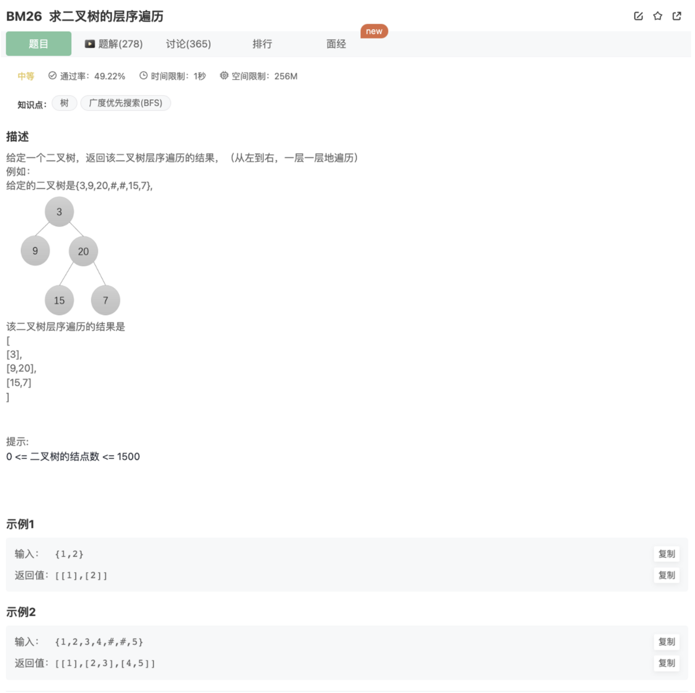

# 二叉树的层序遍历

## 题目




## 代码

思路：BFS的升级版本（加上了统计每一层的功能）

```jsx
/**
  * @param root TreeNode类 
  * @return int整型二维数组
  */
function levelOrder( root ) {
   if(!root) return []
    let res = []
    // 所谓层序遍历，其实就是BFS，这里还增加了一个难点--需要按层划分，并且将该层输入进一个数组
    function traverse(res,root){
      if(!root) return 
      let queue = []
      let layer = []
      let last = root // 标记每一层最后一个元素
      let tail = root // 记录当前最后元素，当进入每一次层最后的元素的时候，将其作为下一层的最后元素（last = tail）
      queue.push(root)
      // 一层一层统计
      while(queue.length){
        let curNode = queue.shift()
        layer.push(curNode.val)
        if(curNode.left){
          queue.push(curNode.left)
          tail = curNode.left
        } 
        if(curNode.right){
          queue.push(curNode.right)
          tail = curNode.right
        } 
        console.log(curNode,last)
        // 当前遍历的元素是当前层最后的元素
        if(curNode === last){ 
          res.push(layer) // 该层元素数组推入结果数组
          last = tail // 重新选新的下一层的最后元素
          layer = [] // 清空下一层的元素数组
        }
      }
    }
    traverse(res,root)
    return res
}
```