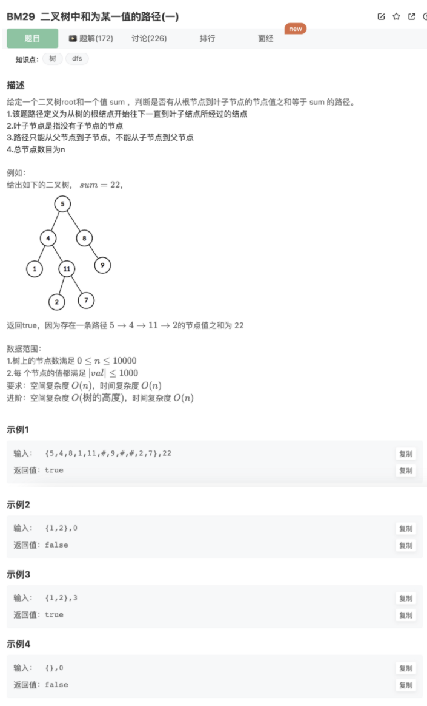

# 二叉树中和为某一值的路径

## 题目




## 代码

递归

```jsx
/**
  * 
  * @param root TreeNode类 
  * @param sum int整型 
  * @return bool布尔型
  */
function hasPathSum( root , sum ) {
    if(!root) return false // 到头了，这条路不行
    if(!root.left && !root.right && (sum - root.val === 0)) return true // 到叶子结点了，检查一下是否ok
    return hasPathSum(root.left,sum - root.val) || hasPathSum(root.right,sum - root.val) // 当前结点下面的左右两个是否ok
}
```

非递归

使用辅助栈实现DFS

```jsx
/**
  * @param root TreeNode类 
  * @param sum int整型 
  * @return bool布尔型
  */
function hasPathSum( root , sum ) {
    if(!root) return false
    // 非递归，使用辅助栈
    let stack1 = [root]
    let stack2 = [root.val]
    while(stack1.length){
      let cur = stack1.pop()
      let curSum = stack2.pop()
      console.log(cur)
      if(!cur.left && !cur.right && curSum == sum) return true
      if(cur.right){
        stack1.push(cur.right)
        stack2.push(curSum + cur.right.val)
      }
      if(cur.left){
        stack1.push(cur.left)
        stack2.push(curSum + cur.left.val)
      }
    }
    return false
}
```