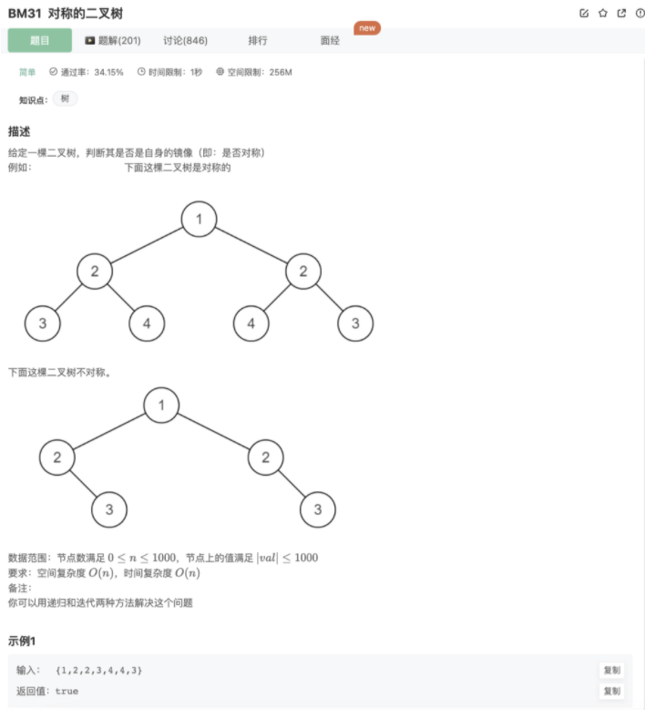
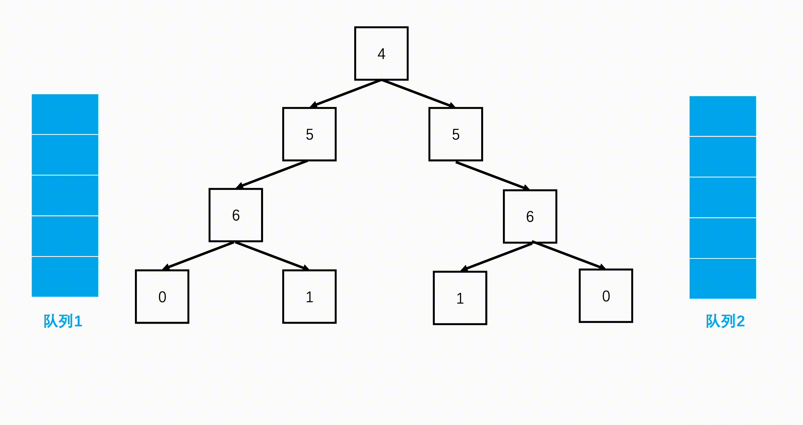

# 对称的二叉树

## 题目



## 代码

```jsx
/* function TreeNode(x) {
    this.val = x;
    this.left = null;
    this.right = null;
} */
function isSymmetrical(pRoot)
{
    if((!pRoot || !pRoot.left && !pRoot.right)) return true
    function recursion(node1,node2){
        if(!node1 && !node2) return true // 到终点ok，说明这一分支是ok的
        if(!node1 || !node2 || node1.val != node2.val) return false // 某一结点有问题，直接返回false
        return recursion(node1.left,node2.right) && recursion(node1.right,node2.left) // 回溯的时候采用的是交集，只有2个分支为true的时候才是true
// 最后只要有一个分支是false，最后的结果都是false
    }
    return recursion(pRoot.left,pRoot.right)

}
```

## 其他思路

辅助队列



```java
import java.util.*;
public class Solution {
    boolean isSymmetrical(TreeNode pRoot) {
        //空树为对称的
        if(pRoot == null) 
            return true;
        //辅助队列用于从两边层次遍历
        Queue<TreeNode> q1 = new LinkedList<TreeNode>(); 
        Queue<TreeNode> q2 = new LinkedList<TreeNode>();
        q1.offer(pRoot.left);
        q2.offer(pRoot.right);
        while(!q1.isEmpty() && !q2.isEmpty()){ 
            //分别从左边和右边弹出节点
            TreeNode left = q1.poll(); 
            TreeNode right = q2.poll();
            //都为空暂时对称
            if(left == null && right == null)
                continue;
            //某一个为空或者数字不相等则不对称
            if(left == null || right == null || left.val != right.val)
                return false;
            //从左往右加入队列
            q1.offer(left.left); 
            q1.offer(left.right);
            //从右往左加入队列
            q2.offer(right.right); 
            q2.offer(right.left);
        }
        //都检验完都是对称的
        return true;
    }
}
```