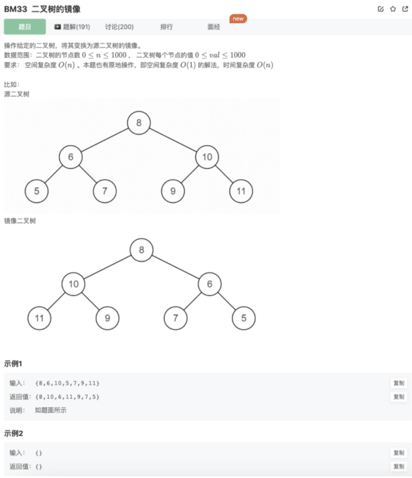
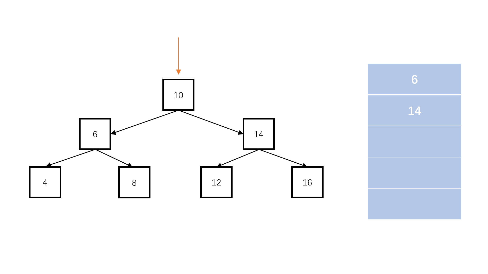

# 反转二叉树

## 题目



## 代码

```jsx
/**
 * 代码中的类名、方法名、参数名已经指定，请勿修改，直接返回方法规定的值即可
 * @param pRoot TreeNode类 
 * @return TreeNode类
 */
function Mirror( pRoot ) {
    // 
    function recursion(pRoot){
        if(!pRoot) return null
        let node = new TreeNode(pRoot.val)
        node.left = recursion(pRoot.right)
        node.right = recursion(pRoot.left)
        return node
    }
    return recursion(pRoot)
}
```

## 其他思路

辅助栈



```java
import java.util.*;
public class Solution {
    public TreeNode Mirror (TreeNode pRoot) {
        //空树
        if(pRoot == null)  
            return null;
        //辅助栈
        Stack<TreeNode> s = new Stack<TreeNode>(); 
        //根节点先进栈
        s.push(pRoot); 
        while (!s.isEmpty()){ 
            TreeNode node = s.pop();
            //左右节点入栈
            if(node.left != null) 
                s.push(node.left);
            if(node.right != null) 
                s.push(node.right);
            //交换左右
            TreeNode temp = node.left; 
            node.left = node.right;
            node.right = temp;
        }
        return pRoot;
    }
}
```