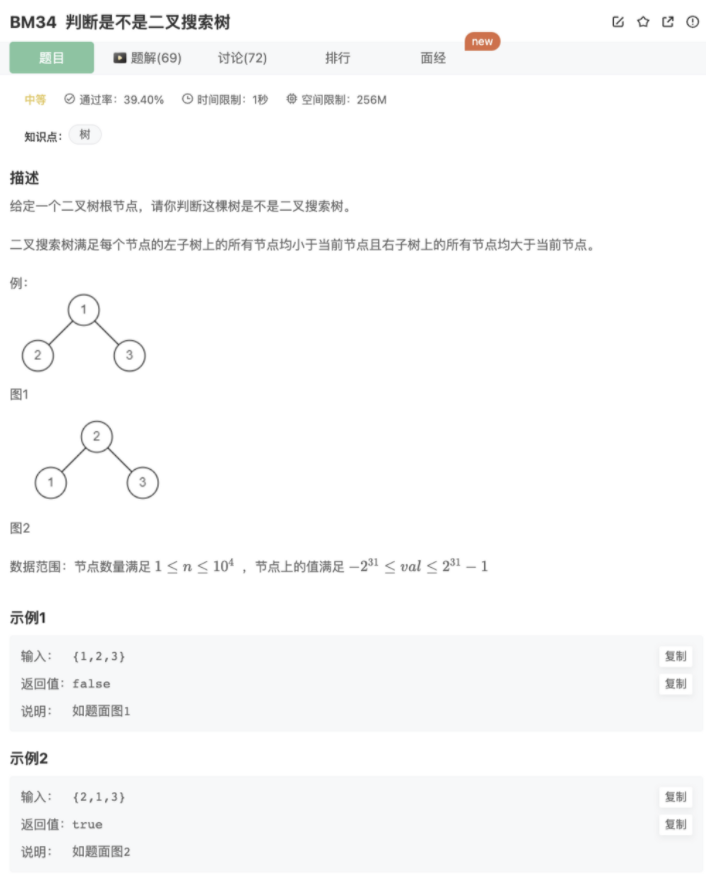

# 判断是不是二叉搜索树

## 题目



## 思路

所谓二叉搜索树，就是【左边的结点都大于右边的结点】的二叉树

利用中序遍历可以从左到右遍历

记录遍历的上一个节点和当前节点，如果当前节点（下一个右边节点）更加小，则不是二叉搜索树

利用了布尔递归返回值`leftRes && rightRes`去递归检查每一个节点的情况

## 代码

```jsx
/**
 * 代码中的类名、方法名、参数名已经指定，请勿修改，直接返回方法规定的值即可
 * @param root TreeNode类 
 * @return bool布尔型
 */
function isValidBST( root ) {
    if(!root || (!root.left && !root.right)) return true
    let pre = null
    function recursion(node){
        if(!node) return true
        let leftRes = recursion(node.left)

        if(!pre) {
            pre = node
        }else{
            if(node.val < pre.val) return false
            else pre = node
        }
        
        let rightRes = recursion(node.right)
        return leftRes && rightRes
    }
    return recursion(root)
}
```

## 其他思路

辅助栈


```jsx
import java.util.*;
public class Solution {
    public boolean isValidBST(TreeNode root){
        //设置栈用于遍历
        Stack<TreeNode> s = new Stack<TreeNode>(); 
        TreeNode head = root;
        //记录中序遍历的数组
        ArrayList<Integer> sort = new ArrayList<Integer>(); 
        while(head != null || !s.isEmpty()){
            //直到没有左节点
            while(head != null){   
                s.push(head);
                head = head.left;
            }
            head = s.pop();
            //访问节点
            sort.add(head.val); 
            //进入右边
            head = head.right; 
        }
        //遍历中序结果
        for(int i = 1; i < sort.size(); i++){ 
            //一旦有降序，则不是搜索树
            if(sort.get(i - 1) > sort.get(i)) 
                return false;
        }
        return true;
    }
}
```