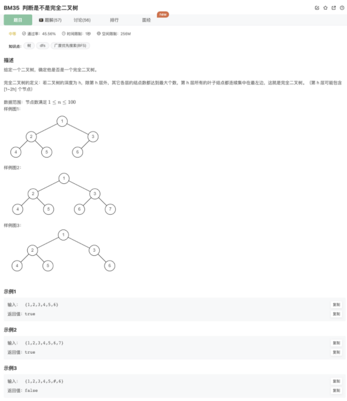

# 判断是不是完全二叉树

## 题目



## 思路

借助了层序遍历

分析了完全二叉树的特征

得出一下解题算法：

分层层序遍历，队列中放节点的时候，不管是否为有效结点，记录无效节点，如果后续遍历又有有效结点则判定不是完全二叉树

## 代码

```jsx
/**
 * 代码中的类名、方法名、参数名已经指定，请勿修改，直接返回方法规定的值即可
 * @param root TreeNode类 
 * @return bool布尔型
 */
function isCompleteTree( root ) {
    // 思路：分层层序遍历，队列中放节点的时候，不管是否为有效结点，记录无效节点，如果后续遍历又有有效结点则判定不是完全二叉树
    if(!root) return false
    if(!root.left && !root.right) return true
    let queue = [root]
    let nullCount = 0
    while(queue.length){
        let cur = queue.shift()
        if(!cur) {
            nullCount++
            continue
        }
        if(nullCount && cur) return false
        queue.push(cur.left)
        queue.push(cur.right)
    }
    return true
}
```