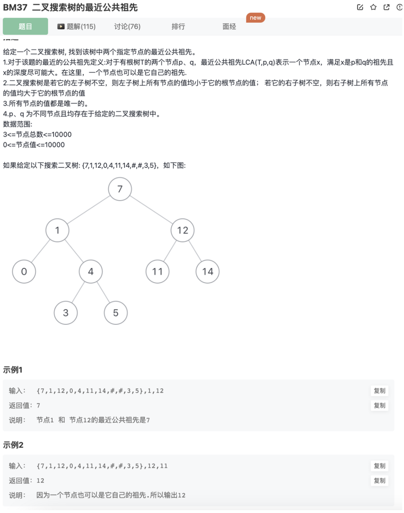

# 二叉搜索树的最近公共祖先

## 题目




## 思路

利用二叉搜索树左边大于右边的特性去做

思路：

1.辅助数组记录2方路径

分别查找2方的节点，记录查找过程的节点


2.递归找第一个分叉的结点


## 代码

1.辅助数组记录2方路径

```jsx
/**
 * 代码中的类名、方法名、参数名已经指定，请勿修改，直接返回方法规定的值即可
 * @param root TreeNode类 
 * @param p int整型 
 * @param q int整型 
 * @return int整型
 */
function lowestCommonAncestor( root ,  p ,  q ) {
    // 利用二叉搜索树左边大于右边的特性去做
    // 思路1.辅助数组记录2方路径
    function findPath(node,val){
        let path = []
        while(node){
            if(val < node.val){
                path.push(node)
                node = node.left
            }else if(node.val < val){
                path.push(node)
                node = node.right
            }else {
                path.push(node)
                break
            }
        }
        return path
    }
    function comparePath(root,p,q){
        let path1 = findPath(root,p)
        let path2 = findPath(root,q)
        let same = path1[0]
        // 2者从头开始找共同的结点，最后一个共同的结点就是最近公共祖先
        for(let i=0;i<path1.length && i<path2.length;i++){
            if(path1[i].val === path2[i].val){
                console.log(path1[i])
                same = path1[i]
            }else{
                break
            }
        }
        return same.val
    }
    return comparePath(root,p,q)
}
```

2.递归找第一个分叉的结点

```jsx
/**
 * 代码中的类名、方法名、参数名已经指定，请勿修改，直接返回方法规定的值即可
 * @param root TreeNode类 
 * @param p int整型 
 * @param q int整型 
 * @return int整型
 */
function lowestCommonAncestor( root ,  p ,  q ) {
    // 递归遍历，找第一个分叉节点，利用了尾递归
    if(root === null) return -1
    if(root.val > p && root.val > q){ // 当前节点大于2个查找节点，说明在当前节点的左子树
        return lowestCommonAncestor(root.left) 
    }else if(root.val < p && root.val < q){ // 当前节点小于2个查找节点，说明在当前节点的右子树
        return lowestCommonAncestor(root.right)
    }else{ // 否则必然，一个大于或者一个小于，此时当前节点是第一个分叉节点也是最后一个公共节点
        return root.val
    }
}
```