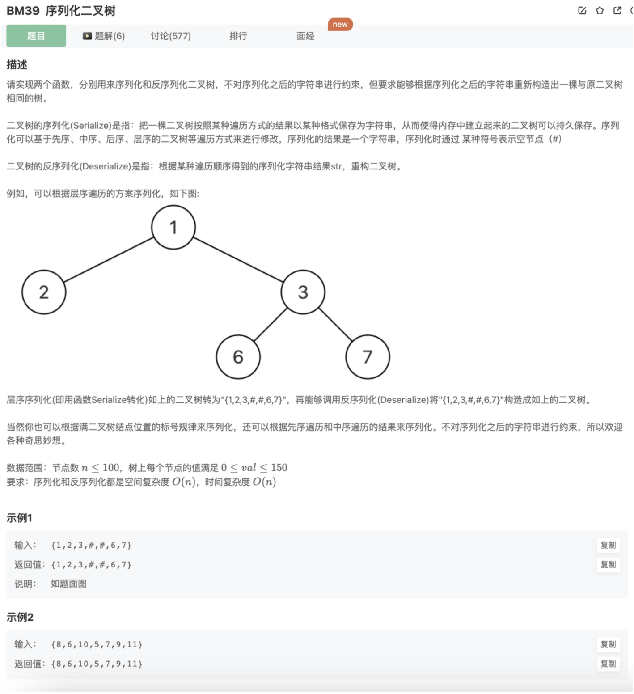

# 序列化二叉树

## 题目




## 代码

层序遍历，序列化和反序列化

```jsx
function TreeNode(x) {
    this.val = x;
    this.left = null;
    this.right = null;
} 
function Serialize(pRoot)
{
    // 层序遍历序列化
    let queue = [pRoot]
    let res = []
    while(queue.length){
        let cur = queue.shift()
        if(cur) res.push(cur.val)
        else res.push('#')

        if(cur){
            queue.push(cur.left)
            queue.push(cur.right)
        }
    }
    while(res[res.length-1] === '#'){
        res.pop()
    }
    res = `{${res.join(',')}}`
    return res
}
function Deserialize(s)
{
    if(s.length === 2) return 
    // 字符串转数组
    let treeArr = s.slice(1,s.length-1).split(',').map(Number)
    
    // 处理
    let cur = treeArr.shift()
    let head = new TreeNode(cur)
    let nodeArr = []
    nodeArr.push(head)
    while(nodeArr.length){
        // 拿到一个结点，初始化val和left、right
        cur = nodeArr.shift()
        if(!cur.val ) continue
        // left
        let left = new TreeNode(treeArr.shift())
        nodeArr.push(left)
        if(left.val) {
            cur.left = left
        }else{
            cur.left = null
        }
        // right
        let right = new TreeNode(treeArr.shift())
        nodeArr.push(right)
        cur.right = right
        if(right.val) {
            cur.right = right
        }else{
            cur.right = null
        }
    }
    return head
}
module.exports = {
    Serialize : Serialize,
    Deserialize : Deserialize
};
```

