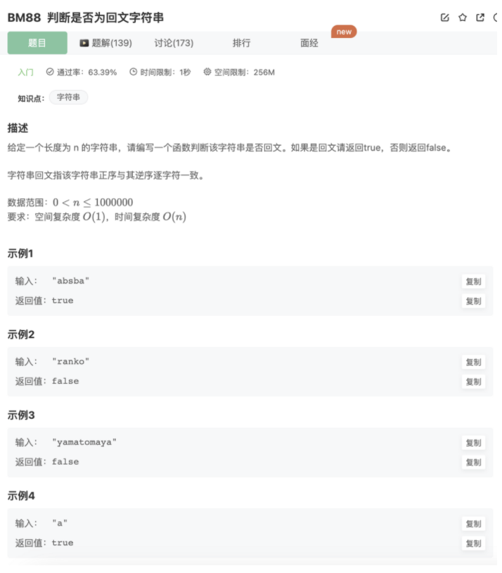

# 判断是否为回文子串

## 题目



## 代码

```jsx
/**
 * 代码中的类名、方法名、参数名已经指定，请勿修改，直接返回方法规定的值即可
 * 
 * @param str string字符串 待判断的字符串
 * @return bool布尔型
 */
function judge( str ) {
    let left = 0
    let right = str.length-1
    while(left<right){
        if(str[left] === str[right]){
            left++
            right--
        }else{
            return false
        }
    }
    return true
}
module.exports = {
    judge : judge
};
```