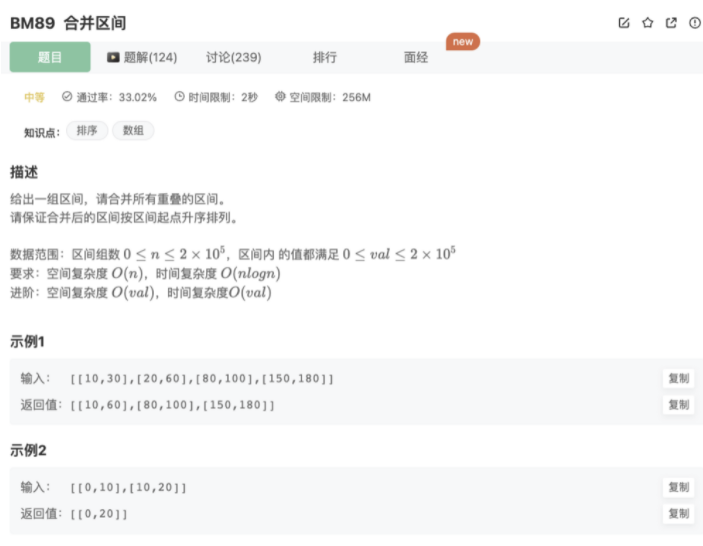

# 合并区间

## 题目




## 代码

```javascript
/*
 * function Interval(a, b){
 *   this.start = a || 0;
 *   this.end = b || 0;
 * }
 */

/**
 * 
 * @param intervals Interval类一维数组 
 * @return Interval类一维数组
 */
function merge( intervals ) {
    let res = []
    // 去掉特殊情况
    if(intervals.length === 0){
        return res
    }
    // 排序
    intervals.sort((a,b)=>{
        return a.start - b.start
    })
    res.push(intervals[0])
    let count = 0
    // 贪心，拿到第一个加入res，然后遍历后面的元素，当前元素和res最后一个元素去看看有没有重叠，然后处理
    for(let i = 1;i<intervals.length;i++){
        let o1 = intervals[i]
        let origin = res[count]
        if(o1.start > origin.end){
            res.push(o1)
            count++
        }else{
            // 最后一个pop掉，构建一个新的合并区间
            res.pop()
            let s = new Interval(origin.start,o1.end)
            if(o1.end < origin.end){
                s.end = origin.end
            }
            res.push(s)
        }
    }
    return res
}
module.exports = {
    merge : merge
};
```

