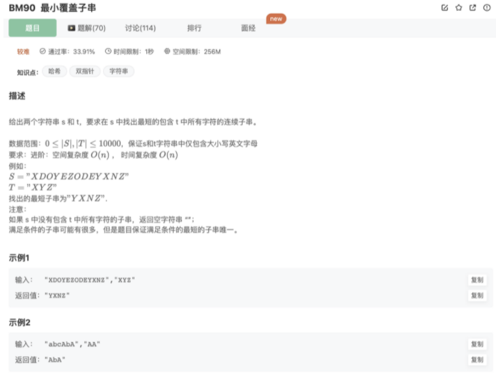
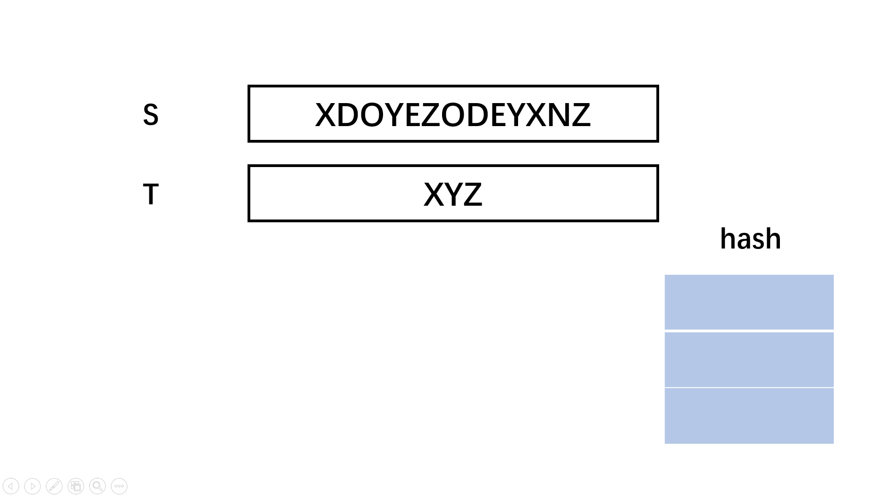

# 最小覆盖子串

## 题目




## 思路

1.哈希表匹配

知识点1:**滑动窗口**

滑动窗口是指在数组、字符串、链表等线性结构上的一段，类似一个窗口，而这个窗口可以依次在上述线性结构上从头到尾滑动，且窗口的首尾可以收缩。我们在处理滑动窗口的时候，常用双指针来解决，左指针维护窗口左界，右指针维护窗口右界，二者同方向不同速率移动维持窗口

知识点2:**哈希表**

哈希表是一种根据关键码（key）直接访问值（value）的一种数据结构。而这种直接访问意味着只要知道key就能在O(1)间内得到value，因此哈希表常用来统计频率、快速检验某个元素是否出现过等。

原理：

1.遍历目标字符串并利用hash去统计，出现则减一

2.fast指针前进遍历待查询字符串，如果hash有则+1，并且查看hash中的项是否全≤0

3.用一个while承载上述判断，如果进入循环，则代表目前窗口满足条件，用变量记录当前窗口的左右指针和大小。并且尝试移动窗口左边指针缩小窗口，移动的时候注意如果移走的字符在hash有值，则需要加1恢复。（如果缩小后仍然进入while循环,则继续尝试缩小）

4.while循环不满足则回到fast+1继续第二步的遍历

滑动窗口逻辑如下：



2.暴力解法

见下面代码

## 代码

1.hash初始化为负数再增加+双指针滑动窗口

```jsx
/**
  * @param S string字符串 
  * @param T string字符串 
  * @return string字符串
  */
function minWindow( S ,  T ) {
    if(T.length > S.length) return ''
    // 
    function check(hash){
        for (const [key, value] of hash) {
            if(value<0){
                return false
            }
        }
        return true
    }
    let cnt = S.length + 1
    // hash记录T的字符出现次数
    let hash = new Map()
    for(let i=0;i<T.length;i++){
        let c = hash.get(T[i])
        if(c !== undefined){
            let num = hash.get(T[i])
            hash.set(T[i], --num)
        }else{
            hash.set(T[i],-1)
        }     
    }
    let slow = 0,fast = 0
    let left = -1,right = -1    // 记录最后的结果
    // fast指针不断前进
    for(;fast<S.length;fast++){
        let c = S[fast] // 拿出当前字符
        // 目标字符匹配+1消除
        if(hash.get(c) != undefined){
            hash.set(c,hash.get(c)+1)
        } 
        // 没有小于0的说明都覆盖了，缩小窗口
        while(check(hash)){
            // 取最优解
            if(cnt>fast - slow + 1){
                cnt = fast - slow + 1
                left = slow
                right = fast
            }
            // 
            c = S[slow]
            if(hash.get(c) !== undefined){
                hash.set(c,hash.get(c)-1) 
            } 
            slow++
        }
    }
    // 找不到的情况
    if(left == -1) return ''
    return S.substring(left,right+1)
}
module.exports = {
    minWindow : minWindow
};
```

2.暴力解法

会超时

```jsx
/**
  * 
  * @param S string字符串 
  * @param T string字符串 
  * @return string字符串
  */
function minWindow( S ,  T ) {
    if(!T){
        return ''
    }
    // 
    let shortest = ''
    let min = S.length+1
    let hash = new Map()
    for(let i=0;i<S.length;i++){
        for(let j=i;j<S.length;j++){
            // 如果当前子串包含
            if(validateChar(S.slice(i,j+1),T)){
                if(j+1-i<=min){
                    min = j+1-i
                    shortest = S.slice(i,j+1)
                }
            }
        }
    }
    if(min === S.length+1){
        return ''
    }else{
        return shortest
    }

    // 查找当前子串s是否含有t全部字符
    function validateChar(s,t){
        for(let i=0;i<t.length;i++){
            let index = s.indexOf(t[i])
            if(index===-1){
                return false
            }else{
                let arr = s.split('')
                arr.splice(index,1)
                 s = arr.join('')
            }
        }
        return true
    }
    

}
module.exports = {
    minWindow : minWindow
};
```